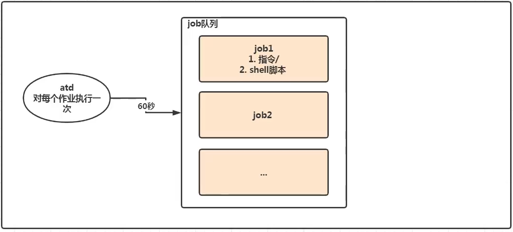
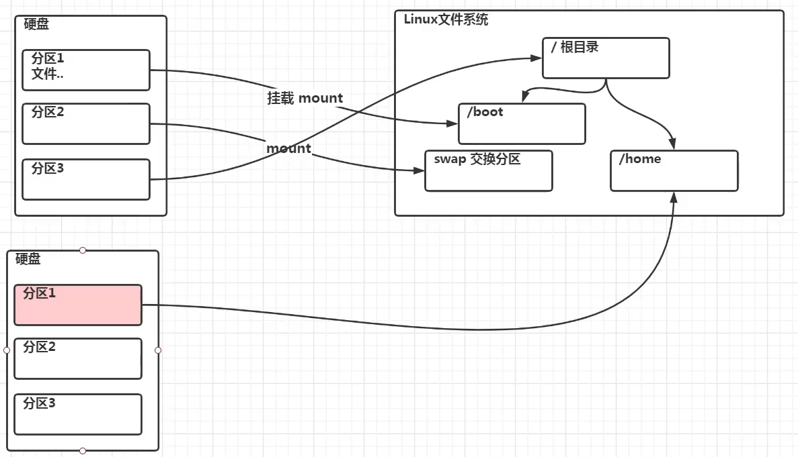
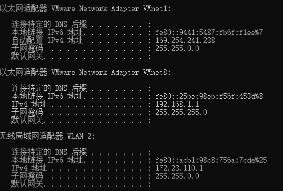
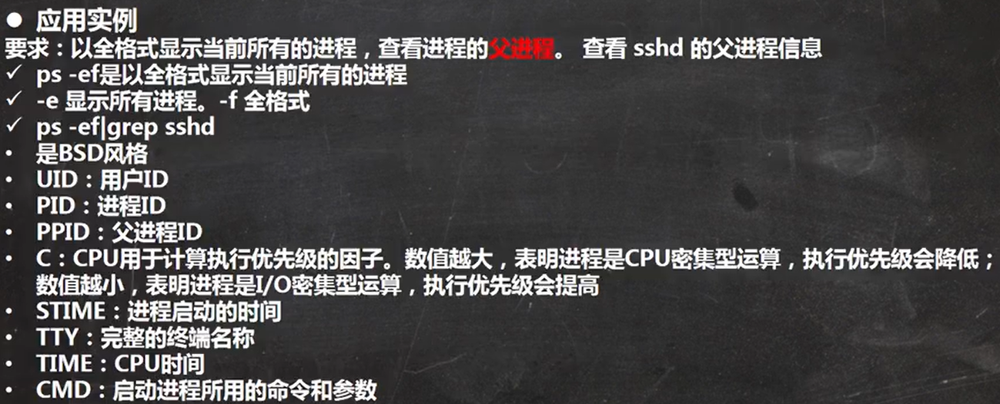

# Linux基础篇

## Linux 目录结构

### 基本介绍

1. Linux的文件系统是采用级层式的树状目录结构，在此结构中的最上层是根目录'/'，然后是在此目录下在创建其他的目录。

2. 深刻理解Linux树状文件目录是非常重要的
  3. 记住一句经典的话:==在Linux世界里，一切皆文件==

### 具体的目录结构

+ **/** 根目录
+ **/bin**  (/usr/bin 、/usr/local/bin) 是Binary的缩写
+ **/sbin**（/usr/sbin、 /usr/local/sbin）s就是Super User 的意思，这里存放的系统管理员使用的系统管理程序
+ **/home** 存放普通用户的主目录，在Linux中的每个用户都有一个自己的目录，一般该目录名是以用户的账号名命名
+ **/root** 该目录为系统管理员，也称超级权限者的用户主目录
+ **/lib** 系统开机所需要最基本的动态链接共享库，其作用类似于Windows中的DLL文件。几乎所有的应用程序都需要用到这些共享库
+ **/lost+found** 这个目录一般情况下是空的，当系统非法关机后，这里就存放了一些文件
+ **/etc** 所有的系统管理所需要的的配置文件和子目录，比如安装mysql数据库my.conf
+ **/usr** 这是一个非常重要的目录，用户的很多应用程序和文件都放在这个目录下，类似于Windows下的program files目录
+ **/boot** 存放的是启动Linux时使用的一些核心文件，包括一些连接文件以及镜像文件
+ **/proc**【不能动】 这是一个虚拟的目录，它是系统内存的映射，访问这个目录来获取系统信息
+ **/srv**【不能动】 service缩写，该目录存放一些服务启动之后需要提取的数据
+ **/sys**【不能动】 这里Linux2.6内核的一个很大的变化。该目录下安装了2.6内核中新出现的一个文件系统sysfs
+ **/tmp** 这个目录是用来存放一些临时文件的
+ **/dev** 类似于Windows中的设备管理器，把所有的硬件用文件的形式存储  
+ **/media** Linux系统会自动识别一些设备，例如U盘、光驱等等，当识别后，Linux会把识别的设备挂载到这个目录下
+ **/mnt** 系统提供该目录是为了让用户临时挂载别的文件系统的，我们可以将外部的存储挂载在/mnt/上，然后进入该目录就可以查看里的内容了。
+ **/opt** 这是给主机额外安装软件摆放的目录。如安装ORACLE数据库就可放在该目录下，默认为空
+ **/usr/local** 这是另一个给主机额外安装软件所安装的目录。一般是通过编译源码方式安装的程序
+ **/var** 这是目录中存放着在不断扩充着的东西，习惯将经常被修改的目录存放在这个目录下。包括各种日志文件
+ **/selinux** 【security-enhanced Linux】 SELinux是一种安全子系统，它能控制程序只能访问特定文件，有三种工作模式，可以自行设置

## vi 和 vim的介绍

+ 正常模式

  以vim打开一个文档就直接进入了一般模式（这是默认的模式）。在这个模式中，你可以使用==上下左右==按键来移动光标，你可以使用==删除字符==或者==删除整行==来处理文档内容，也可以使用==复制、粘贴==来处理你的文件数据。

+ 插入模式

  按下`i、I、o、O、a、A、r、R`等任何一个字母之后才会进入编辑模式，一般来说按i即可。

+ 命令行模式

  输入`ESC`在输入：在这个模式中，可以提供你相关指令，完全读取、存盘、替换、离开vim、显示行号等的动作则是在此模式中达成的！


### vi和vim快捷键

+ 快捷键的使用练习
  1. 拷贝当前行 `yy` ，拷贝当前行向下的5行 `5yy` ，并粘贴（`输入p`）
  2. 删除当前行 `dd` ，删除当前行向下的5行 `5dd`
  3. 在文件中查找某个单词 【命令行下输入 `/关键字`，回车查找，输入 `n`就是查找下一个】
  4. 设置文件的行号，取消文件的行号【命令行下 `:set nu`和 `:set nonu`】
  5. 编辑文件，使用快捷键`G`到该文档的最末行和快捷键`gg`到最首行
  6. 在一个文件中输入"**hello**"，在一般模式下，然后又撤销这个动作用快捷键`u`
  7. 在编辑文档时，在一般模式下，将光标移动到20行，输入 `20 shift+g`
  8. [更多快捷键](https://blog.csdn.net/jisuanji198509/article/details/86690617/)……

## 开机、重启和用户登录注销

### 关机&重启命令

+ 基本介绍

  `shutdown -h now`	或者 `init 0`立即进行关机

  `shutdown -h 1`	一分钟后进行关机

  `shutdown -r now` 或者	`init 6`立即进行重启计算机

  `halt`	关机、作用和上面一样

  `reboot`	立即进行重启计算机

  `sync`	把内存的数据同步到磁盘

+ 注意细节

  1. 不管是重启系统还是关闭系统，首先要运行`sync`命令，把内存中的数据写到磁盘中
  2. 目前的`shutdown/reboot/halt`等命令均已经在关机钱运行了sync命令

### 用户登录和注销

+ 基本介绍
  1. 登录时尽量少用==root==账号登录，因为它是系统管理员有最大的权限，避免操作失误。可以利用普通用户登录，登录后在使用`su -用户名`命令来切换成系统管理员身份
  2. 在提示符下输入`logout`即可注销用户

+ 使用细节

  1. `logout`注销指令在图形运行级别无效，在运行级别==3==（多用户无图形）下有效

## 用户管理

### 基本介绍

Linux系统是一个多用户多任务的操作系统，任何一个要使用系统资源的用户，都必须首先向系统管理员申请一个账号，然后以这个账号的身份进入系统

### 添加用户

+ 基本语法

  `useradd  用户名`

+ 细节说明

  1. 当创建用户成功后，会自动的创建和用户同名的家目录 `/home/用户`
  2. 也可以通过`useradd -d`指定目录新的用户名，给新创建的用户指定家目录

### 指定/修改密码

+ 基本语法

  `passwd 用户名`

### 删除用户

+ 基本语法

  `userdel 用户名`

+ 应用案例

  1. 删除用户，但是要保留家目录， `userdel 用户名`
  2. 删除用户以及用户主目录， `userdel -r 用户名`

+ 细节说明

  **一般情况下，建议保留家目录**

### 查询用户信息指令

+ 基本语法

  `id 用户名`

  

### 切换用户

+ 介绍

  在操作Linux中，如果当前用户的权限不够，可以通过`su -`指令，切换到高权限用户，比如root

+ 基本语法

  `su -切换用户名`

+ 细节说明

  1. 从权限高的用户切换到权限低的用户，不需要输入密码，反之需要
  2. 当返回到原来的用户时，使用`exit/logout`指令

### 查看当前用户/登录用户

+ 基本语法

`whoami/who am i` 

### 用户组

+ 介绍

  类似于角色，系统可以对有共性/权限的多个用户进行统一的管理

+ 新增组

  指令：`groupadd 组名`

+ 删除组

  指令：`groupdel 组名`

+ 增加用户时直接加上组

  指令：`useradd -g 用户组 用户名`

+ 修改用户的组

  指令：`usermod -g 用户组 用户名`

### 用户和组相关文件

+ **/etc/passwd** 文件

  用户的配置文件，记录着用户的各种信息

  每行的含义：==用户名:口令:用户标识符:组标识符:注释性描述:主目录:登录Shell==

+ **/etc/shadow** 文件

  口令的配置文件

  每行的含义：==登录名:加密口令:最后一次的修改时间:最小时间间隔:最大时间间隔:警告时间:不活动时间:失效时间:标志==

+ **/etc/group** 文件

  组的配置文件，记录着Linux包含的组的信息

  每行含义：==组名:口令:组标识号:组内用户列表==

  

## 实用指令

### 指定运行指令

+ 基本介绍

  运行级别说明：

  + `0：关机`

  + `1：单用户【找回丢失密码】`

  + `2：多用户状态没有网络服务`
  + `3：多用户状态有网络服务`

  + `4：系统未使用保留给用户`

  + `5：图形界面`

  + `6：系统重启`

  常用运行级别是3和5，也可以指定默认运行级别

+ 应用实例

  命令：`init [0123456]` 通过`init`来切换不同的运行级别

+ Centos7后运行级别说明

  在centos7以前，**/etc/inittab**文件中进行了简化，如下：

  ```shell
  multi-user.target:analogous to runlevel 3
  graphical.target:analogous to runlevel 5
  ```

+ 查看当前运行级别

  `systemctl get-default`

+ 设置默认的运行级别

  `systemctl set-default TARGET.target`

### 找回root密码

[找回密码……](https://zhuanlan.zhihu.com/p/102802164)

### 帮助指令

+ man 获取帮助信息

  基本语法：`man 【命令或配置文件】`（功能描述：获得帮助信息）

  案例：`man ls`  在Linux下，隐藏文件是以 . 开头，选项可以组合使用， 比如 `ls -al`

+ help指令

  基本语法：`help 命令`（功能描述：获得shell内置命令的帮助信息）

### 文件目录类

+ pwd指令

  基本语法：`pwd` （功能描述：显示当前工作目录的绝对路径）

+ ls指令

  基本语法：`ls [选项] [目录或者文件]`

  常用选项：

  + `-a`：显示当前目录所有的文件和目录，包括隐藏的
  + `-l`：以列表的方式显示信息

+ cd 指令

  基本语法：`cd [参数]`（功能描述：切换到指定目录）

  `cd ~`：回到自己的家目录

  `cd ..`：回到当前目录的上一级目录

+ mkdir指令  ==用于创建目录==

  基本语法：`mkdir [选项] 目录`

  常用选项：`-p`：创建多级目录

+ rmdir指令    ==删除空目录==

  基本语法：`rmdir [选项] 要删除的空目录`

  使用细节：

  + `rmdir`删除的是空目录，如果目录下是有内容时是无法删除的
  + `rm -rf 目录`：可以删除任何目录或者文件

+ touch 指令  ==创建空文件==

  基本语法：`touch 文件名称`

+ cp指令  ==拷贝文件到指定目录==

  基本语法：`cp [选项] 源目录 目标目录`

  常用选项：`-r` ：递归复制整个文件夹

  使用细节：强制覆盖不提示的方法：`\cp`

+ rm指令  ==移除文件或目录==

  基本语法：`rm [选项] 要删除的文件或者目录`

  常用选项：

  + `-r`：递归删除整个文件夹
  + `-f`：强制删除不提示

+ mv指令  ==移动文件与目录或者重命名==

  基本语法：

  + `mv oldNameFile newNameFile` **注：两个文件在同一个目录下**（功能描述：重命名）
  + `mv 老目录 新目录`（功能描述：移动文件）

+ cat指令 ==查看文件内容==

  基本语法：`cat [选项] 要查看的文件`

  常用选项：`-n`：显示行号

  使用细节：`cat` 只能浏览文件，而不能修改文件，为了浏览方便，一般会带上 `管道命令 | more`

+ more指令

  more指令是一个基于vi编辑器的文本过滤器，它以全屏幕的方式按页显示文本文件的内容。more指令中内置了若干快捷键。

  基本语法：`more 文件`

+ less指令：

  less指令用来分屏查看文件内容，它的功能与more指令相似，但是比more指令更加强大，支持各种显示终端。less指令在显示文件内容时，并不是一次将整个文件加载之后才显示，而是根据显示需要加载内容，对于大型文件具有较高的效率。

  基本语法：`less 文件`

+ echo指令  ==输出内容到控制台==

  基本语法：`echo [选项][输出内容]`

+ head指令  ==用于显示文件的开头部分内容，默认情况下head指令显示文件的前10行内容==

  基本语法：

  + `head 文件`（功能描述：查看文件头10行内容）
  + `head -n 5 文件`（功能描述：查看文件头5行内容，5可以是任意行数）

+ tail指令  ==用于输出文件中尾部的内容，默认情况下tail指令显示文件的最后10行内容==

  基本语法：

  + `tail 文件` （功能描述：查看文件尾10行的内容）
  + `tail -n 5文件`（功能描述：查看文件尾5行的内容，5可以是任意行数）
  + `tail -f 文件`（功能描述：实时追踪该文档的所有更新）

+ \> 指令和\>>指令

  `>  输出重定向`   和 `>>追加`

  基本语法：

  + `ls -l > 文件`（功能描述：列表的内容写入文件（覆盖写））
  + `ls - al >>文件`（功能描述：列表的内容追加到文件的尾部）
  + `cat 文件1 >文件2`（功能描述：将文件1的内容覆盖到文件2）
  + `echo “内容” >> 文件`（功能描述：将“内容”追加到文件）

+ ln指令 ==软链接也称符号链接，类似于Windows里的快捷方式，主要存放了连接其他文件的路径==

  基本语法：`ln -s [原文件或目录][软链接名]`（功能描述：给原文件创建一个软链接）

  删除软链接：`rm 软链接名`

  细节说明：当我们使用pwd指令查看目录时，仍然看到的是软链接所在的目录

+ history 指令 ==查看已经执行过的历史命令，也可以执行历史命令==

  基本语法：`history` （功能描述：查看已经执行过的历史命令）

### 时间日期类

+ date指令——==显示当前日期==

  基本语法：

  + `date`（功能描述：显示当前时间）
  + `date +%Y` （功能描述：显示当前年份）
  + `date +%m` （功能描述：显示当前月份）
  + `date +%d` （功能描述：显示当前是哪一天）
  + `date "+%Y-%m-%d %H:%M:%S"`（功能描述：显示年月日时分秒）

+ date指令——==设置日期==

  基本语法：`date -s 字符串时间`

+ cal指令 ==查看日历指令==

  基本语法：`cal [选项]` （功能描述：不加选项，显示本月日历）

### 搜索查找类

+ find指令  ==将从指定目录向下递归地遍历其各个子目录，将满足条件的文件或者目录显示在终端==

  基本语法：`find [搜索范围][选项]`

  选项说明：

  

+ locate 指令

  locate指令可以快速定位文件路径。locate指令利用事先建立的系统中所有文件名称及路径的locate数据库实现快速定位给定的文件。locate指令无需遍历整个文件系统，查询速度快。为了保证查询结果的准确度，管理员必须定期更新locate时刻

  基本语法：`locate 文件名`

  特别说明：由于locate指令基于数据库进行查询，所以第一次运行前，**必须使用`updatedb`指令创建locate数据库。**

+ which指令

  which指令可以查看某个指令在哪个目录下，比如ls指令在哪个目录

  `which ls`

+ grep指令和管道符号|

  grep 过滤查找，管道符“|”，表示将前一个命令的处理结果输出传递给后面的命令处理。

  基本语法：`grep [选项] 查找内容 源文件`

  常用选项：

  + `-n`：显示匹配行及行号
  + `-i`：忽略字母大小写

### 压缩和解压类

+ gzip/gunzip指令  ==gzip用于压缩**文件**，gunzip用于解压**文件**的==

  基本语法：

  + `gzip 文件`（功能描述：压缩文件，只能将文件压缩为*.gz文件）
  + `gunzip 文件.gz`（功能描述：解压缩文件命令）

+ zip/unzip指令  ==zip用于压缩文件，unzip用于解压的，这个在项目打包发布时很有用的==

  基本语法：

  + `zip [选项]  XXX.zip 要压缩的内容` （功能描述：压缩文件和目录的命令）
  + `unzip [选项]  XXX.zip`（功能描述：解压缩文件）

  zip常用选项：`-r`：递归压缩，即压缩目录

  unzip常用选项：`-d<目录>`：指定解压后文件的存放目录 

+ tar 指令 ==tar指令是打包指令，最后打包成的文件是*.tar.gz的文件==

  基本语法：`tar [选项] XXX.tar.gz 打包的内容` （功能描述：打包目录，压缩后的文件格式是.tar.gz）

  选项说明：

  

### Linux组基本介绍

+ 在Linux中的每个用户必须属于一个组，不能独立于组外。在linux中每个文件有所有者、所在组、其他组的概念。

### 文件/目录所有者 

一般谁创建了该文件，就自然的的成为了该文件的所有者。

+ 查看文件的所有者

  指令：`ls -ahl`

+ 修改文件的所有者

  指令：`chown 用户名 文件名` 

### 创建组

+ 基本指令

  `groupadd 组名`

### 文件/目录 所在组

当某个用户创建了一个文件后，这个文件的所在组就是该用户所在的组。

+ 查看文件/目录所在组

  基本指令：`ls -ahl`

+ 修改文件所在的组

  基本指令：`chgrp 组名 文件名`

### 改变用户所在组

在添加用户时，可以指定将该用户添加到哪个用户组中，同样的用root的管理权限也可以修改每个用户所在的组

+ 改变用户所在的组
  1. `usermod -g 新组名 用户名`（功能描述：改变用户所在的组）
  2. `usermod -d 目录名 用户名` （功能描述：改变用户登录的初始目录）==特别说明：用户需要有进入新目录的权限==

### 权限的基本介绍

`ls -l`中显示的内容如下：

```shell
-rw-r--r-- 1 ljw wudang    0  4月 13 11:36 dog.txt
```

**0-9位说明**

1. 第0位确定文件的类型（ ==d , - , l , c , b== ）

   `l`是链接，相当于Windows中的快捷方式

   `d `是目录，相当于Windows中的文件夹

   `c`是字符设备文件，如鼠标，键盘

   `b`是块设备，比如硬盘 

2. 第1-3位确定所有者（该文件的所有者）拥有该文件的权限。--User

3. 第4-6位确定所属组（同用户组的）拥有该文件的权限。--Group

4. 第7-9位确定其他用户拥有该文件的权限。--Other

**其他说明**

1. `1`		文件：硬链接数 或者 目录：子目录数（包括隐藏目录）
2. `ljw`   用户
3. `wudang`  组
4. `0`     文件大小（字节），如果是文件夹，显示4096字节
5. `4月13 11:36`    最后修改时间
6. `dog.txt`    文件名

### rwx权限详解

+ rwx作用到文件

  1. `[r]`代表可读（read）：可以读取，查看
  2. `[w]`代表可写（write）：可以修改，但是不代表可以删除该文件，删除一个文件的前提条件是对该文件所在的目录有写权限，才能删除该文件。
  3. `[x]`代表可执行（execute）：可以被执行

+ rwx作用到目录

  1. `[r]`代表可读（read）：可以读取，`ls`查看目录内容
  2. `[w]`代表可写（write）：可以修改，对目录内创建+删除+重命名目录
  3. `[x]`代表可执行（execute）：可以进入该目录

  **可用数字表示为：r=4 ， w=2，x=1 因此 rwx = 4+2+1 =7 **

### 修改权限-chmod

+ 基本说明

  通过chmod指令，可以修改文件或者目录的权限

+ 第一种方式：`+  -  =`变更权限

  u:所有者   g:所有组 o:其他人  a:所有人（u、g、o的总和）

  1. `chmod u=rwx,g=rx,o=x文件/目录名`
  2. `chmod o=w 文件/目录名` 
  3. `chmod a-x 文件/目录名`

+ 第二种方式：通过数字变更权限

  r=4 w=2 x=1 rwx=4+2+1=7

  **chmod u=rwx,g=rx,o=x文件/目录名   相当于   chmod 751 文件/目录名**

### 修改文件所有者-chown

+ 基本介绍

  `chown newowner 文件/目录  ` 改变所有者

  `chown newowner:newgroup 文件/目录` 改变所有者和所在组

  `-R`  如果是目录，则使其下所有子文件或目录递归生效

### 修改文件/目录所在组-chgrp

+ 基本介绍

  `chgrp newgroup 文件/目录` 改变所在组

  `-R`  如果是目录，则使其下所有子文件或目录递归生效

## 定时任务调度

### crond任务调度

==crontab==进行定时任务的设置


+ 概述

  任务调度：是指系统在某个时间执行的特定的命令或者程序

  任务调度分类：1.系统任务：有些重要的任务必须周而复始地执行，如病毒扫描

  2.个别用户工作：个别用户可能希望执行某些程序，比如对mysql数据库的备份。

+ 基本语法

  `crontab [选项]`

+ 常用选项

  

+ 快速入门

  + 设置任务调度文件：/etc/crontab

  + 设置个人任务调度。执行`crontab -e` 指令
  + 接着输入任务到调度文件

  **如：`*/1**** ls -l /etc/ > /tmp/to.txt`     意思说每小时的每分钟执行 `ls -l /etc/ > /tmp/to.txt`命令**

+ 参数细节说明

  + 五个占位符的说明

  

  + 特殊符号的说明

  

  + `crontab -r`：终止任务调度
  + `crontab -l`：列出当前有哪些任务调度
  + `service crond restart`： 重启任务调度


###  at定时任务



+ 基本介绍

  1. at命令是一次性定时计划任务，at的守护进程atd会以后台模式运行，检查作业队列来运行
  2. 默认情况下，atd守护进程每60秒检查作业队列，有作业时，会检查作业运行时间，如果时间与当前时间匹配，则运行此作业
  3. at命令是一次性定时计划任务，执行完一个任务后不再执行此任务了
  4. 在使用at命令时，一定要保证atd进程的启动，可以使用相关指令来查看

+ at命令格式

  `at [选项] [时间]`

  `Ctrl + D `结束at命令的输入（输入两次）

  `strm [编号]` 删除任务

+ at命令选项


+ at时间定义 


## Linux磁盘分区、挂载

### Linux分区

+ 原理介绍
  1. Linux来说无论有几个分区，分给哪一个目录使用，它归根结底就只有一个根目录，一个独立且唯一的文件结构，Linux中每个分区都是用来组成整个文件系统的一部分
  2. Linux采用了一种叫“载入”的处理方法，它的整个文件系统中包含了一整套的文件和目录，且将一个分区和目录联系起来。这时要载入的一个分区将使它的存储空间在一个目录下获得。



+ 硬盘说明

  1. Linux硬盘分IDE硬盘和SCSI硬盘，目前基本上是SCSI硬盘
  2. 对于SCSI标识为“sdx~”，SCSI硬盘使用“sd”来表示分区所在设备的类型的，其余则和IDE硬盘的表示方法一样。

+ 查看所有设备挂载情况

  命令：`lsblk` 或者 `lsblk -f`

### 磁盘情况查询

+ 查询系统整体磁盘使用情况

  基本语法：`df -h`

+ 查询指定目录的磁盘占用情况

  基本语法

  `du -h /目录`

  查询指定目录的磁盘占用情况，默认为当前目录

  `-s`：指定目录占用大小汇总

  `-h`：带计量单位

  `-a`：含文件

  `--max-depth=1`：子目录深度

  `-c`：列出明细的同时，增加汇总值

### 磁盘情况--工作使用指令

1. 统计/opt文件夹下文件的个数

   `ls -l /opt | grep "^-" | wc -l`

2. 统计/opt文件夹下目录的个数

   `ls -l /opt | grep "^d" | wc -l`

3. 统计/opt文件夹下文件的个数，包括子文件夹里的

   `ls -lR /opt | grep "^-" | wc -l`

4. 统计/opt文件夹下目录的个数，包括子文件夹下的

   `ls -lR /opt | grep "^d" | wc -l`

5. 以树状显示目录结构

   `tree  目录`


## 网络配置

### 查看网络IP和网关

+ 查看Windows环境中的VMnet8网络配置（`ipconfig`指令）



+ 查看Linux中配置  

  `ifconfig`

  

###  ping 测试主机之间网络连通性

+ 基本语法

  `ping 目的主机`（功能描述：测试当前服务器是否可以连接目的主机）

+ 应用实例

  `ping www.baidu.com`

### Linux网络环境配置

+ 第一种方法（自动获取）

  说明：登录后，通过界面来设置自动获取ip，特点：Linux启动后会自动获取ip，缺点是每次自动获取的IP地址可能不一样。

+ 第二种方法（指定ip）

  说明：直接修改配置文件来指定ip，并可以连接到外网（程序员推荐）

  编辑 `vi /etc/sysconfig/network-scripts/ifcfg-ens33`

  要求：将IP地址配置成静态的，比如：IP地址为192.168.200.111

  ==ifcfg-ens33文件说明==

  ```
  DEVICE = eth0    #接口名（设备，网卡）
  HWADDR = 00:00:XX:XX:XX:XX     #MAC地址
  TYPE = Ethernet    #网络类型（通常是Ethernet）
  UUID = 			   #随机id
  #系统启动时的网络接口是否有效
  ONBOOT = yes
  #IP 的配置方法[none|static|bootp|dhcp](引导时不使用协议|静态分配IP|BOOTP协议|DHCP协议)
  BOOTPROTO = static
  #IP地址
  IPADDR = 192.168.200.111
  #网关
  GATEWAY = 192.168.200.1
  #域名解析器
  DNS1 = 8.8.8.8
  ```

  

  **重启网络服务或者重启系统生效**

  `service network restart 或者 reboot`

### 设置主机名和hosts映射

+ 设置主机名

  1. 为了方便记忆，可以给Linux系统设置主机名，也可以根据需要修改主机名
  2. 指令 `hostname`：查看主机名
  3. 修改文件在 `/etc/hostname`指定
  4. 修改后，重启生效

+ 设置hosts映射

  思考：如何通过主机名能够找到（比如ping）某个Linux系统？

  **Windows：**

  在C:\Windows\System32\drivers\etc\hosts文件指定即可

  案例：192.168.200.130 localhost

  **Linux**

  在/etc/hosts文件指定

  案例：192.168.200.130 localhost

## 进程管理

### 基本介绍

1. 在Linux中，每个执行的程序都称为一个进程。每个进程都分配一个ID号（pid，进程号）。
2. 每个进程都可能以两种方式存在的。前台与后台，所谓前台进程就是用户目前的屏幕上可以进行操作的。后台进程则是实际在操作，但由于屏幕上无法看到的进程，通常使用后台方式执行。
3. 一般系统的服务都是以后台进程的方式存在，而且都会常驻在系统中。知道关机才结束。

### 显示系统执行的进程

+ 基本介绍

  `ps`命令是用来查看目前系统中，有哪些正在执行，以及他们的执行的情况，可以不加任何参数。

  

  `ps`常用选项：

  ​		`ps -a`：显示当前终端的所有进程信息

  ​		`ps -u`：以用户得到格式显示进程信息

  ​		`ps -x`：显示后台进程运行的参数

+ 应用实例



### 终止进程kill和killall

+ 介绍：

  若是某个进程执行一半需要停止时，或是已消了很大的系统资源是，此时可以考虑停止该进程。可以使用`kill`命令来完成此项任务。

+ 基本语法：

  `kill [选项] 进程号`（功能描述：通过进程号杀死/终止进程）

  `killall 进程名称`（功能描述：通过进程名称杀死进程，也支持通配符，这在系统因负载过大而变得很慢时很有用）

+ 常用选项

  `-9`：表示强迫进程立即停止

### 查看进程树pstree

+ 基本语法

  `pstree [选项]` 可以更加直观的来看进程信息

+ 常用选项：

  `-p`：显示进程的PID

  `-u`：显示进程的所属用户

### 服务（service）管理

+ 介绍

  服务（service）本质就是进程，但是是运行在后台的，通常都会监听某个端口，等待其他进程的请求，比如（mysql、sshd、防火墙等），因此我们又称为守护进程，是Linux中非常重要的知识点。

+ service管理指令

  1. `service 服务名[ start | stop | restart | reload | status ]`
  2. 在centos7.0之后，很多服务不再使用`service`，而是使用`systemctl`
  3. `service`指令管理的服务在`/etc/init.d`查看

+ 查看服务名：

  + 方式1：使用`setup` -> 系统服务就可以看到全部
  + 方式2：`/etc/init.d` 看到service指令管理的服务

+ 服务的运行级别（runlevel）:

  Linux系统有7种运行级别：常用的级别是3和5

  ```
  运行级别0：系统停机状态，系统默认运行界别不能设为0，否则不能正常启动
  运行级别1：单用户工作状态，root权限，用于系统维护，禁止远程登录
  运行级别2：多用户状态（没有NFS），不支持网络
  运行级别3：完全的多用户状态（有NFS），登录后进入控制台命令行模式
  运行级别4：系统未使用，保留
  运行级别5：X11控制台，登陆后进入图形GUI模式
  运行级别6：系统正常关闭并重启，默认运行级别不能设为6，否则不能正常启动
  ```

  

+ chkconfig 指令

  **介绍:**

  1. 通过`chkconfig`命令可以给服务的各个运行级别设置自启动/关闭
  2. `chkconfig`指令管理的服务在/etc/init.d 查看
  3. 注意：centos7.0后，很多服务使用systemctl管理

  **chkconfig基本语法**

  + 查看服务 `chkconfig --list [|grep xxx]`
  + `chkconfig 服务名 --list`
  + `chkconfig --level 5 服务名 on/off`

  **使用细节**

  ​	`chkconfig`重新设置服务后自启动或者关闭，需要重启机器`reboot`生效

  > systemctl管理指令

+ systemctl管理指令

  1. 基本语法：`systemctl [ start | stop | restart | status ] 服务名` **注：这种方式只是临时启动**
  2. systemctl指令管理的服务在 `/usr/lib/systemd/system` 查看

+ systemctl设置服务的自启动状态

  1. `systemctl list-unit-files [|grep 服务名]`（查看服务开机启动状态，grep可以进行过滤）
  2. `systemctl enable 服务名`（设置服务开机启动）
  3. `systemctl disable 服务名`（关闭服务开机启动）
  4. `systemctl is-enabled 服务名`（查询某个服务是否是自启动）

+ 打开或者关闭指定端口


+ firewall 指令

  打开端口： `firewall-cmd --permanent --add-port=端口号/协议`

  关闭端口： `firewall-cmd --pernmanent --remove-port=端口号/协议`

  重新载入，才能生效： `firewall-cmd --reload`

  查询端口是否开放： `firewall-cmd --query-port=端口/协议号`

### 动态监控进程

+ 介绍

  top与ps命令很相似。它们都是用来显示正在执行的进程。top与ps最大的不同之处，在于top在执行一段时间可以更新正在运行的进程。

+ 基本语法

  `top [选项]`

+ 选项说明

  

+ 交互操作说明：

  

  `u [用户名]`：查看某个用户的进程

  `k [进程ID号]`：结束某个进程

### 监控网络状态

+ 查看系统网络情况netstat

  基本语法

  `netstat [选项]`

  选项说明

  `-an `：按一定的顺序排列输出

  `-p`：显示哪个进程在调用 

## RPM与YUM

### rpm包的管理

+ 介绍

  rpm用于互联网下载包的打包及安装工具，它包含在某些Linux分发版中。它生成具有.RPM扩展名的文件。RPM是Redhat Package Manager（Redhat软件包管理工具）的缩写，类似于Windows中的setup.exe，这一文件格式名称上虽然打上了redhat的标志，但理念是通用的。

+ rpm包的简单查询指令

  查询已安装的rpm列表： `rpm -qa | grep xx`

+ rpm包名基本格式

  一个rpm包名：Firefox-60.2.2-1.el7.centos.x86_64

  名称：Firefox

  版本号：60.2.2-1

  适用操作系统：el7.centos.x86_64

  表示centos7.x的64位系统

  如果是i686、i386表示32位系统，noarch表示通用。

+ rpm包的其它查询指令：

  `rpm -qa`：查询所安装的所有rpm软件包

  `rpm -qa | more`

  `rpm -qa | grep X`

  `rpm -q 软件包名`：查询软件包是否安装

  `rpm -i 软件包名`：查询软件包的信息

  `rpm -ql 软件包名`：查询软件包中的文件

  `rpm -qf 文件全路径名`：查询文件所属的软件包

+ 卸载rpm包：

  基本语法：

  `rpm -e rpm包的名称`

+ 安装rpm包

  基本语法：

  `rpm -ivh rpm包全路径名称`

  参数说明：

  `-i = install `：安装 

  `-v = verbose `：提示

  `-h = hash`：进度条

### yum

+ 介绍

  yum是一个Shell前端软件包管理器。基于rpm包管理，能够从指定的服务器自动下载rpm包并安装，可以自动处理依赖性关系，并且一次安装所有依赖的软件包。

+ yum 的基本指令

  + 查询yum服务器是否有需要安装的软件

    `yum list | grep XX`

  + 安装指定的yum包

    `yum install xxx`：下载安装软件


## Shell编程

### Shell是什么

Shell是一个命令行解释器，它想用户提供了一个向Linux内核发送请求以便运行程序的界面系统级程序，用户可以用Shell来启动、挂起、停止甚至是编写一些程序。

### Shell脚本的执行方式

+ 脚本格式要求

  1. 脚本以#！/bin/sh开头
  2. 脚本需要有可执行权限

+ 编写第一个Shell脚本

  需求说明：创建一个Shell脚本，输出Hello world！

+ 脚本的常用执行方式

  + 方式1：（输入脚本的绝对路径或相对路径）

    **说明：首先要赋予Hello world.sh 脚本的+x 权限，再执行脚本**

  + 方式2：（sh+脚本）

    **说明：不用赋予脚本+x权限，直接执行即可 **

### Shell的变量

+ Shell变量介绍
  1. Linux Shell中的变量分为系统变量和用户自定义变量
  2. 系统变量：`$HOME、$PWD、$SHELL、$USER`等等，比如： echo $HOME 等等...
  3. 显示当前shell中的所有变量：`set`
+ Shell变量的定义
  + 基本语法
    1. 定义变量：`变量名=值` **注：=两边不能有空格**
    2. 撤销变量：`unset 变量`
    3. 声明静态变量：`readonly 变量`， 注意：不能unset
  + 变量定义的规则
    1. 变量名称可以由字母、数字和下划线组成，但是不能以数字开头。
    2. 等号两侧不能有空格
    3. 变量名称一般习惯大写
  + 将命令的返回值赋给变量
    1. A=	``date `反引号，运行里面的命令，并把结果返回给变量A
    2. `A=$(date)`等价于反引号``

### 设置环境变量

+ 基本语法

  1. `export 变量名=变量值` （功能描述：将shell变量输出为环境变量/全局变量）
  2. `source 配置文件`   （功能描述：让修改后的配置信息立即生效）
  3. `echo $变量名`   （功能描述：查询环境变量的值）

+ 快速入门

  1. 在/etc/profile文件中定义TOMCAT_HOME环境变量
  2. 查看环境变量TOMCAT_HOME的值
  3. 在另外一个shell程序中使用TOMCAT_HOME

  **注意：在输出TOMCAT_HOME环境变量前，需要让其生效 `source /etc/profile`**

  > shell脚本的多行注释
  >
  > :<<!内容!

### 位置参数变量

+ 介绍

  当我们执行一个shell脚本是，如果希望获取到命令行的参数信息，就可以使用到位置参数变量。比如：./myshell.sh 100 200 ，这个就是一个执行shell的命令行，可以在myshell脚本中获取到参数的信息。

+ 基本语法：

  + `$n`（功能描述：n为数字，$0代表命令本身，$1-$9代表第一到第九个参数，十以上的参数需要用大括号包含，如${10}）

  + `$*`（功能描述：这个变量代表命令行中所有的参数，$*把所有的参数看成一个整体）

  + `$@`（功能描述：这个变量也代表命令行中的所有参数，不过$@把每个参数区分对待）

  + `$#`（功能描述：这个变量代表命令行中所有参数的个数）

    代码：

  

  ​	   结果：

  

### 预定义变量

+ 基本介绍

  就是Shell设计者事先已经定义好的变量，可以直接在Shell脚本中使用。

+ 基本语法

  + `$$`（功能描述：当前进程的进程号（PID））
  + `$！`（功能描述：后台运行的最后一个进程的进程号（PID））
  + `$?`（功能描述：最后一次执行的命令的返回状态。如果这个变量的值是0，证明上一个命令正确执行；如果这个变量的值为非0（具体是哪个数，由命令自己来决定），则证明上一个命令执行不正确了）

  代码：

  

  结果：

  

### 运算符

+ 基本介绍

  学习如何在shell中运行各种运算操作

+ 基本语法

  1. `"$((运算符))"`或 `“$[运算符]”`或者`expr m + n`
  2. **注意:**`expr `运算符间要有空格,如果希望将expr的结果赋给某给变量，使用``
  3. `expr m-n`
  4. `expr \*,/,%`  乘、除、取余

  代码：

  

  结果：

  

  

### 条件判断

+ 判断语句

  基本语法

  `[ condition ] （注意condition前后要有空格）`

  ==**注：非空返回true，可使用$?验证（0为true，1为false）**==

  常用判断条件：

  + `=`字符串比较

  + 两个整数的比较

    `-lt`小于

    `-le`小于等于

    `-eq`等于

    `-gt`大于

    `-ge`大于等于

    `-ne`不等于

  + 按照文件权限进行判断

    `-r`有读的权限

    `-w`有写的权限

    `-x`有执行的权限

  + 按照文件类型进行判断

    `-f`文件存在并且是一个常规文件

    `-e`文件存在

    `-d`文件存在并且是一个目录

    代码：

    

    结果：

    

### 流程控制

+ if判断

  + 基本语法

    ```shell
    if [ 条件判断式 ]
    then 
    代码
    fi
    ```

    

    **或者多分支**

    ```shell
    if [ 条件判断式 ]
    then
    代码
    elif [ 条件判断式 ]
    then
    代码
    fi
    ```

    

    

    **注意事项：[ 条件判断式 ]，中括号与条件判断式之间必须有空格**

  代码：

  

​			结果：

​				

+ case语句

  + 基本语法

    ```
    case $变量名 in
    "值1")
    如果变量的值等于值1，则执行程序1
    ;;
    "值2")
    如果变量的值等于值2，则执行程序2
    ;;
    ···省略其他分支···
    *)
    如果变量的值都不是以上的值，则执行次程序
    ;;
    esac
    ```

    代码：

    

    结果：

    


+ for 循环


  + 基本语法1

    ```shell
    for 变量 in 值1 值2 值3 ···
    do
    程序/代码
    done
    ```
    
    代码：
    
    
    
      结果：


  + 基本语法2

    ```shell
    for((初始值;循环控制条件;变量变化))
    do
    程序/代码
    done
    ```

    代码：
    
    

​		结果：


+ while循环

  + 基本语法

    ```shell
    while [ 条件判断式 ]
    do
    程序
    done
    ```

    **注意：while与中括号之间有空格，条件判断式与中括号之间也有空格**

    代码：

    

    结果：

    

+ read读取控制台输入

  + 基本语法

    `read [选项] （参数）`

  + 选项

    `-p`：指定读取值时的提示信息；

    `-t`：指定读取值时等待的时间（秒），如果没有在指定的时间输入，就不在等待了。

  + 参数：

    变量：指定读取值的变量名

  + 代码：

    

    结果：

    

    

### 函数

+ 函数介绍

  Shell编程与其它编程语言一样，有系统函数，也有自定义函数。

+ 系统函数

  + basename基本语法

    功能：返回完整路径最后/的部分，常用来获取文件名

    `basename [pathname] [suffix]`

    `basename [string] [suffix]` （功能描述：basename命令会删掉所有的前缀包括最后一个“/”字符，然后将字符串显示出来。）

  + 选项：

    suffix为后缀，如果suffix被指定了，basename会将pathname或者string中的suffix去掉。

  + dirname基本语法

    功能：返回完整路径最后/前面的部分，常用于返回路径部分

    dirname文件绝对路径（功能描述：从给定的包含绝对路径的文件名中去除文件名（非目录的部分），然后返回剩下的路径（目录的部分））

+ 自定义函数

  + 基本语法

    ```shell
    function function[()]
    {
    	Action;
    	[return int;]
    }
    ```

    调用直接写函数名:funname [值]

    代码：

     

    结果：

    

# Linux高级篇

## 日志管理

### 基本介绍

1. 日志文件是重要的系统信息文件，其中记录了许多**重要的系统事件**，包括用户的登录信息、系统的启动信息、系统的安全信息、邮件相关的信息、各种服务相关信息等。
2. 日志对于安全来说也是很重要的，它记录了系统每天发生的各种事情，通过日志来检查错误发生的原因，或者受到攻击时留下的痕迹。
3. 可以这样理解，日志是用来记录重要事件的工具。

### 系统常用的日志

> /var/log/目录就是系统日志文件的保存位置，如下图


+ 系统常用的日志


### 日志管理服务

Centos7.6日志服务是rsyslogd，Centos6.x日志服务是syslogd。rsyslogd功能更强大。rsyslogd的使用、日志文件的格式和syslogd服务是兼容的。

+ 查询Linux的rsyslogd服务是否启动

  `ps -aux|grep "rsyslog"|grep -v "grep"`

+ 查询rsyslogd服务的自启动状态

  `systemctl list-unit-files | grep rsyslog`

+ 配置文件：/etc/rsyslog.conf

  编辑文件时的格式为：\*.\*    存放日志文件

  其中第一个* 代表日志类型，第二个* 代表日志级别

  1. 日志类型分为：

     auth								##pam产生的日志

     authpriv						##ssh、ftp等登录信息的验证信息

     corn								##时间任务相关

     kern								##内核

     lpr									##打印

     mail								##邮件

     mark（syslog）-rsyslog								##服务内部的信息，时间标识

     news								##新闻组

     user								##用户程序产生的相关信息

     uucp								##unix to nuix copy主机之间相关的通信

     local 1-7						##自定义的日志设备

  2. 日志级别分为：

     debug							##有调试信息的，日志通信最多

     info								##一般日志信息，最常用

     notice							##最具有重要性的普通条件的信息

     warning						##警告级别

     err									##错误级别，阻止某个功能或者模块不能正常工作的信息

     crit								  ##严重级别，阻止整个系统或者整个软件不能正常工作的信息

     alert								##需要立即修改的信息

     emerg							##内核崩溃等重要信息

     none								##什么都不记录

     **注意：从上到下，级别从低到高，记录信息越来越少**

+ 由日志服务rsyslogd记录的日志文件，日志文件的格式包含以下4列：

  + 时间产生的时间
  + 产生事件的服务器的主机名
  + 产生事件的服务名或程序名
  + 事件的具体信息

+ 日志如何查看实例

  查看一下/var/log/secure日志，这个日志中记录的是用户验证和授权方面的信息，来分析如何查看

### 日志轮替

+ 基本介绍

  日志轮替就是把旧的日志文件移动并改名，同时建立新的空日志文件，当旧日志文件超出保存的范围之后，就会进行删除

+ 日志轮替文件命名

  1. centos7使用logrotate进行日志轮替管理，要想改变日志轮替文件名字，通过/etc/logrotate.conf配置文件中"dateext"参数
  2. 如果配置文件中有"dateext"参数，那么日志会用日期来作为日志文件的后缀，例如”secure-20201010“。这样日志文件名不会重叠，也就不需要日志文件的改名，只需要指定保存日志个数，删除多余的日志文件即可。
  3. 如果配置文件中没有“dateext”参数，日志文件就需要进行改名了。当第一次进行日志轮替时，当前的“secure”日志会自动改名为“secure.1”，然后新建“secure”日志，用来保存新的日志。当第二次进行日志轮替时，“secure.1”会自动改名为“secure.2”，当前的“secure”日志会自动改名为“secure.1”，然后也会新建“secure”日志，用来保存新的日志，以此类推。

  

+ 参数说明

  

+ 把自己的日志加入日志轮替

  

+ 日志轮替机制原理

  日志轮替之所以可以在指定的时间备份日志，是依赖系统定时任务。在/etc/cron/daily/目录，就会发现这个目录中是有logrotate文件（可执行），logrotate通过这个文件依赖定时任务执行的。

### 查看内存日志

`journalctl`:  可以查看内存日志

+ 常用指令

  `journalctl`:  查看全部

  `journalctl -n 3`:  查看最新的3条

  `journalctl --since 19:00 --until 19:10`:  查看起始时间到结束时间的日志

  `journalctl -p err`:  报错日志

  `journalctl -o verbose` ： 日志详细内容

  `jourmalctl_PID=1245 _COMM=sshd`:  查看包含这些参数的日志 或者 `journalctl | grep sshd`

  **注意：**journalctl 查看的是内存日志，重启就会清空