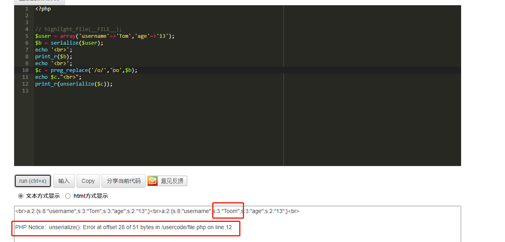
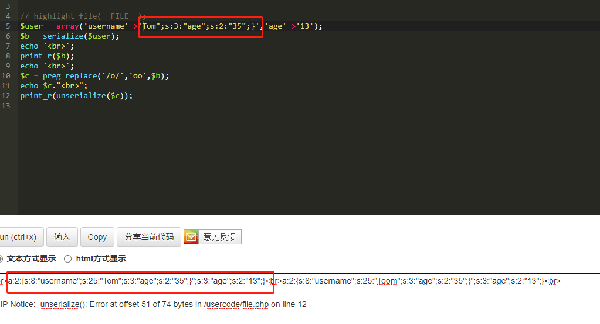
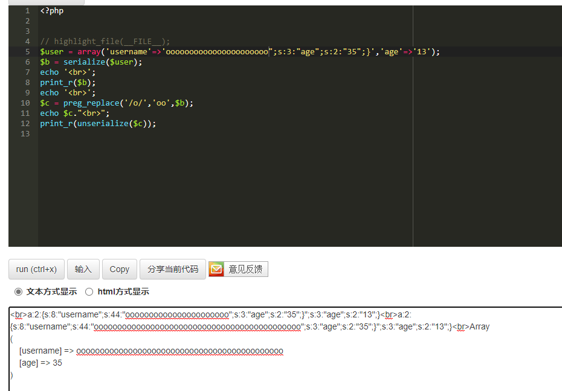
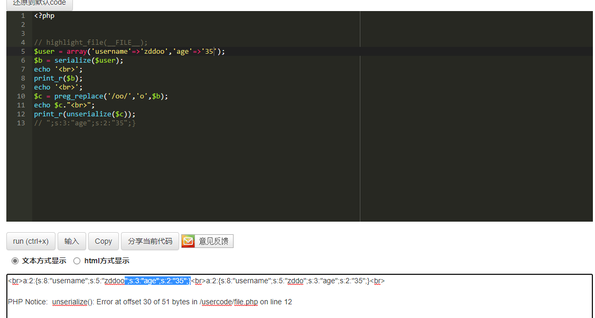
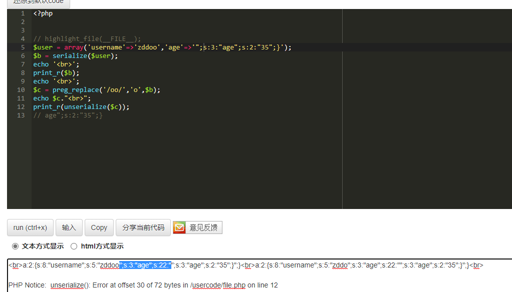
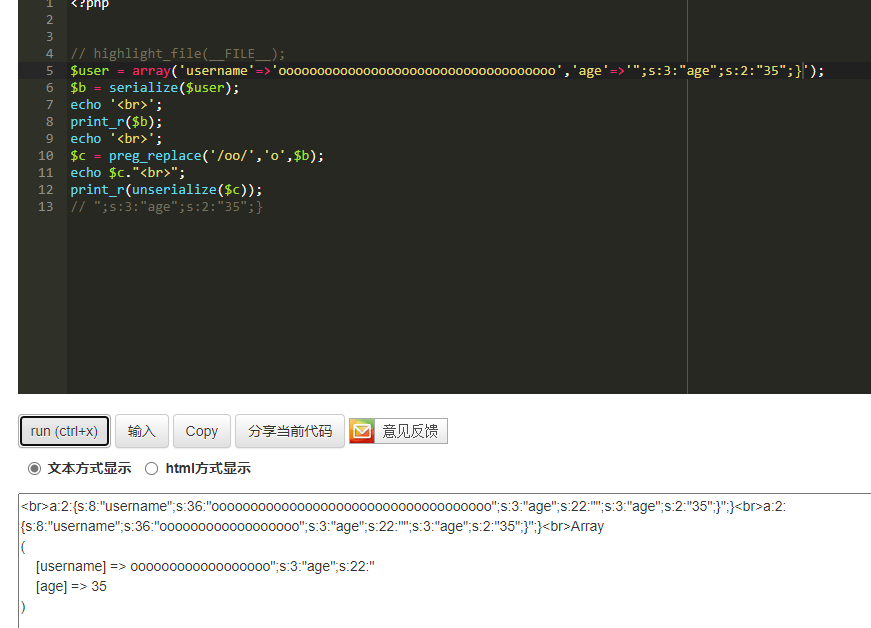

[TOC]


# PHP代码审计

## 刷题遇到的函数

```php
isset():检测变量是否已设置并且非 null
strpos():查找字符串首次出现的位置
error_reporting(v):设置应该报告何种 PHP 错误,当v=0时，关闭所有PHP错误报告
header():发送原生 HTTP 头
curl_init():初始化 CURL 会话
curl_setopt():设置 cURL 传输选项
curl_exec():执行 cURL 会话
ord():函数返回字符串的首个字符的 ASCII 值
die():等同于e
   mt_srandmt_srandxit(), 输出一个消息并且退出当前脚本
==:比较两个参数的值
====:会比较两个变量的类型
exec():执行一个外部程序
preg_match ( string $pattern , string $subject [, array &$matches [, int $flags = 0 [, int $offset = 0 ]]] ):搜索 subject 与 pattern 给定的正则表达式的一个匹配。
var_dump():打印变量的相关信息
$GLOBALS:引用全局作用域中可用的全部变量
file(): 把整个文件读入一个数组中
file_get_contents():将整个文件读入一个字符串
unserialize():对单一的已序列化的变量进行操作，将其转换回 PHP 的值
gzuncompress():解压被压缩的字符串
base64_decode():base64解码
show_source(): 别名 highlight_file():语法高亮一个文件
array_merge(): 合并一个或多个数组
in_array(search,array,type):搜索数组中是否存在指定的值
mb_substr():获取部分字符串
mb_strpos():查找字符串在另一个字符串中首次出现的位置
require(): require 和 include 几乎完全一样，除了处理失败的方式不同之外。require 在出错时产生 E_COMPILE_ERROR 级别的错误。换句话说将导致脚本中止而 include 只产生警告（E_WARNING），脚本会继续运行
range():根据范围创建数组，包含指定的元素
mt_rand():生成更好的随机数
substr(string $string , int $start , int $length = ?):返回字符串的子串，开始位置从0计算
preg_replace():执行一个正则表达式的搜索和替换
str_replace(find,replace,string count):子字符串替换
chr ( int $ascii ) : string 返回指定的字符
random():
addslashes():会在单引号‘,双引号“,反斜杠\以及NULL前添加反斜杠进行转义\，该函数常用于为存储在数据库中的字符串以及数据库查询语句准备字符串。				
strstr():搜索字符串在另一字符串中的第一次出现。
scandir():列出指定路径中的文件和目录
global:声明了全局变量
getenv():获取一个环境变量的值
intval(): 获取变量的整数值
is_numeric(): 检测变量是否为数字或数字字符串
md5(string $string,bool $binary=false):string ：计算字符串的MD5散列值，如果可选的 binary 被设置为 true，那么 md5 摘要将以 16 字符长度的原始二进制格式返回。 
get_defined_funcations():
ctype_alpha():
strrev():反转打印字符串，就是倒着打印
str_rot13 ( string $str ) : string	对 str 参数执行 ROT13 编码并将结果字符串返回。编码和解码都使用相同的函数,传递一个编码过的字符串作为参数，将得到原始字符串。
escapeshellarg ( string $arg ) : string-->把字符串转码为可以在 shell 命令里使用的参数，将给字符串增加一个单引号并且能引用或者转码任何已经存在的单引号;
escapeshellcmd ( string $command ) : string-->对字符串中可能会欺骗 shell 命令执行任意命令的字符进行转义,反斜线（\）会在以下字符之前插入： &#;`|*?~<>^()[]{}$\, \x0A 和 \xFF。
readfile ( string $filename , bool $use_include_path = false , resource $context = ? ) : int-->读取文件并写入到输出缓冲。 
base_convert ( string $number , int $frombase , int $tobase ) : string-->返回一字符串，包含 number 以 tobase 进制的表示。number 本身的进制由 frombase 指定。frombase 和 tobase 都只能在 2 和 36 之间（包括 2 和 36）;
dechex ( int $number ) : string--> 十进制转换为十六进制;
hex2bin ( string $data ) : string--> 转换十六进制字符串为二进制字符串;
implode(): 将一个一维数组的值转化为字符串;
unset():销毁指定的变量;
parse_str():把查询字符串解析到变量中;
uniqid():生成一个唯一ID;
mt_srand(seed): 播种随机数生成函数;
mt_rand(): 生成随机数;
hexdec():函数把十六进制数转换为十进制数;
eval():eval() 函数把字符串按照 PHP 代码来计算,代码以分号结尾;
strpos(string,find,start) :查找字符串在另一字符串中第一次出现的位置（区分大小写）;
rand(min,max):返回介于 min（或 0）与 max（或 mt_getrandmax()）之间（包括边界值）的随机整数;
int file_put_contents ( string $filename , mixed $data [, int $flags = 0 [, resource $context ]] ):把一个字符串写入文件中;
ob_get_contents(): 此函数返回输出缓冲区的内容，或者如果输出缓冲区无效将返回false 。
ob_end_clean():清空（擦除）缓冲区并关闭输出缓冲;
```

**执行运算符：**

> PHP 支持一个执行运算符：反引号（\`）。注意这不是单引号！PHP 将尝试将反引号中的内容作为 shell 命令来执行，并将其输出信息返回（即，可以赋给一个变量而不是简单地丢弃到标准输出）。使用反引号运算符“\`\`”的效果与函数 [shell\_exec()](https://www.php.net/manual/zh/function.shell-exec.php) 相同。

```
 <?php
 $output = `ls -al`;
 echo "<pre>$output</pre>";
 ?> 
```

## 正则表达式

> 正则表达式(regular expression)描述了一种字符串匹配的模式（pattern），可以用来检查一个串是否含有某种子串、将匹配的子串替换或者从某个串中取出符合某个条件的子串等。

### 普通字符

普通字符包括没有显式指定为元字符的所有可打印和不可打印字符。这包括所有大写和小写字母、所有数字、所有标点符号和一些其他符号。

| 字符      | 描述                                                                                    |
| ------- | ------------------------------------------------------------------------------------- |
| \[ABC]  | 匹配 \[...] 中的所有字符，例如 \[aeiou] 匹配字符串 "google runoob taobao" 中所有的 e o u a 字母。            |
| \[^ABC] | 匹配`除了` \[...] 中字符的所有字符，例如 \[^aeiou] 匹配字符串 "google runoob taobao" 中除了 e o u a 字母的所有字母。 |
| \[A-Z]  | \[A-Z] 表示一个区间，匹配所有大写字母，\[a-z] 表示所有小写字母。                                               |
| \[\s\S] | 匹配所有。`\s 是匹配所有空白符`，包括换行，`\S 非空白符`，不包括换行。                                              |
| \w      | 匹配字母、数字、下划线。等价于 \[A-Za-z0-9\_]                                                        |

### 特殊字符

所谓特殊字符，就是一些有特殊含义的字符，如上面说的 `runoo*b` 中的 `*`，简单的说就是表示任何字符串的意思。如果要查找字符串中的 `*` 符号，则需要对 `*` 进行转义，即在其前加一个 \，runo\\\*ob 匹配字符串 **runo\*ob**。

许多元字符要求在试图匹配它们时特别对待。若要匹配这些特殊字符，必须首先使字符"转义"，即，将反斜杠字符\ 放在它们前面。下表列出了正则表达式中的特殊字符：

| 特别字符                                                                                    | 描述                                                                               |
| --------------------------------------------------------------------------------------- | -------------------------------------------------------------------------------- |
| $ \| 匹配输入`字符串的结尾位置`。如果设置了 RegExp 对象的 Multiline 属性，则 $ 也匹配 '\n' 或 '\r'。要匹配 $ 字符本身，请使用 $。 |                                                                                  |
| ( )                                                                                     | 标记一个子表达式的开始和结束位置。子表达式可以获取供以后使用。要匹配这些字符，请使用 ( 和 )。                                |
| \*                                                                                      | 匹配前面的子表达式`零次或多次`。要匹配 \* 字符，请使用 \*。                                               |
| +                                                                                       | 匹配前面的子表达式`一次或多次`。要匹配 + 字符，请使用 +。                                                 |
| .                                                                                       | 匹配除`换行符 \n 之外的任何`单字符。要匹配 . ，请使用 . 。                                              |
| ?                                                                                       | 匹配前面的子表达式`零次或一次`，或指明一个非贪婪限定符。要匹配 ? 字符，请使用 ?。                                     |
| ^                                                                                       | `匹配输入字符串的开始位置`，除非在方括号表达式中使用，当该符号在方括号表达式中使用时，表示不接受该方括号表达式中的字符集合。要匹配 ^ 字符本身，请使用 ^。 |
| \|                                                                                      | 指明`两项之间的一个选择`。要匹配 \|，请使用 \|。                                                     |
| {                                                                                       | 标记`限定符表达式的开始`。要匹配 {，请使用 {。                                                       |

### 限定符

限定符用来指定正则表达式的一个给定组件必须要出现多少次才能满足匹配。有 \* 或 + 或 ? 或 {n} 或 {n,} 或 {n,m} 共6种。

正则表达式的限定符有：

| 字符    | 描述                                                                                                              |
| ----- | --------------------------------------------------------------------------------------------------------------- |
| \*    | 匹配前面的子表达式零次或多次。例如，zo\* 能匹配 "z" 以及 "zoo"。\* 等价于{0,}。                                                             |
| +     | 匹配前面的子表达式一次或多次。例如，'zo+' 能匹配 "zo" 以及 "zoo"，但不能匹配 "z"。+ 等价于 {1,}。                                                 |
| ?     | 匹配前面的子表达式零次或一次。例如，"do(es)?" 可以匹配 "do" 、 "does" 中的 "does" 、 "doxy" 中的 "do" 。? 等价于 {0,1}。                         |
| {n}   | n 是一个非负整数。匹配确定的 n 次。例如，'o{2}' 不能匹配 "Bob" 中的 'o'，但是能匹配 "food" 中的两个 o。                                            |
| {n,}  | n 是一个非负整数。至少匹配n 次。例如，'o{2,}' 不能匹配 "Bob" 中的 'o'，但能匹配 "foooood" 中的所有 o。'o{1,}' 等价于 'o+'。'o{0,}' 则等价于 'o\*'。       |
| {n,m} | m 和 n 均为非负整数，其中n <= m。最少匹配 n 次且最多匹配 m 次。例如，"o{1,3}" 将匹配 "fooooood" 中的前三个 o。'o{0,1}' 等价于 'o?'。请注意在逗号和两个数之间不能有空格。 |

更多语法：[正则表达式中各种字符的含义 - 一个农夫 - 博客园 (cnblogs.com)](https://www.cnblogs.com/afarmer/archive/2011/08/29/2158860.html)

## CTF中PHP常用知识点（重点）

### PHP超全局变量

PHP中的许多预定义变量都是“超全局的”，这意味着它们在一个脚本的全部作用域中都是可用的。在函数或方法中无需执行global $variable;就可以访问它们。

这些超全局变量是：

* $GLOBALS
* $\_SERVER
* $REQUEST
* $\_POST
* $\_GET
* $\_FILES
* $\_ENV
* $\_COOKIE
* $\_SESSION

### PHP的弱类型比较问题

*   前言

    在ctf比赛中，不止一次出现了PHP弱类型的题目，借此想总结一下PHP弱类型以及绕过方式
*   知识介绍

    PHP中有两种比较的符号 `==` 与`===`

    ```php
    <?php
    	$a==$b;
    	$a===$b;
    ?>
    ```

    `===`在进行比较的时候，会先判断两种字符串的类型是否相等，在比较值

    `==`在进行比较的时候，会先将字符串类型转化成相同，再比较

    > 如果比较一个数字和字符串或者比较涉及到数字内容的字符串，则字符串会被转换成数值并且比较按照数值来进行

**这里明确了说如果一个数值和字符串进行比较的时候，会将字符串转换成数值**

```php
 <?php
 var_dump("admin"==0);  //true
 var_dump("1admin"==1); //true
 var_dump("admin1"==1) //false
 var_dump("admin1"==0) //true
 var_dump("0e123456"=="0e4456789"); //true 
 ?>  //上述代码可自行测试
```

> 1 观察上述代码，"admin"==0 比较的时候，会将admin转化成数值，强制转化,由于admin是字符串，转化的结果是0自然和0相等 2 "1admin"==1 比较的时候会将1admin转化成数值,结果为1，而“admin1“==1 却等于错误，也就是"admin1"被转化成了0,为什么呢？？ 3 "0e123456"=="0e456789"相互比较的时候，会将0e这类字符串识别为科学技术法的数字，0的无论多少次方都是零，所以相等

对于上述的问题我查了php手册

> 当一个字符串被当作一个数值来取值，其结果和类型如下:如果该字符串没有包含' . ' , ' e ', ' E' 并且其数值值在整形的范围之内，该字符串被当作int来取值，其他所有情况下都被作为float来取值，**该字符串的开始部分决定了它的值，如果该字符串以合法的数值开始，则使用该数值，否则其值为0。**

```php
 <?php
 $test=1 + "10.5"; // $test=11.5(float)
 $test=1+"-1.3e3"; //$test=-1299(float)
 $test=1+"bob-1.3e3";//$test=1(int)
 $test=1+"2admin";//$test=3(int)
 $test=1+"admin2";//$test=1(int)
 ?>
```

所以就解释了“admin1”==1 ---->False的原因

[php 弱类型总结 +实战](https://www.cnblogs.com/Mrsm1th/p/6745532.html)

### PHP断言（assert）

[PHP断言（ASSERT)的用法 - 菜问 - 博客园 (cnblogs.com)](https://www.cnblogs.com/nixi8/p/7147122.html)

### PHP读取目录下文件的方法

**scandir():读取文件和目录，以数组形式存储**

**print\_r():输出**

```php
<?php
$dir = "/images/";

// Sort in ascending order - this is default
$a = scandir($dir);

// Sort in descending order
$b = scandir($dir,1);

print_r($a);
print_r($b);
?>
```

结果：

```php
Array
(
[0] => .
[1] => ..
[2] => cat.gif
[3] => dog.gif
[4] => horse.gif
[5] => myimages
)
Array
(
[0] => myimages
[1] => horse.gif
[2] => dog.gif
[3] => cat.gif
[4] => ..
[5] => .
)
```

### preg\_match绕过

`preg_match`用于执行正则匹配。返回pattern的匹配次数。它的值是0次（不匹配）或1次，因为preg\_match（）在一次匹配后将会停止搜索。preg\_match\_all()不同与此，它会一直搜索subject直到到达结尾。如果发生错误preg\_match（）返回FALSE。

* 语法

```php
int preg_match ( string $pattern , string $subject [, array &$matches [, int $flags = 0 [, int $offset = 0 ]]] )
```

**搜索 subject 与 pattern 给定的正则表达式的一个匹配。**

参数说明：

 $pattern: 要搜索的模式，字符串形式。

 $subject: 输入字符串。

 $matches: 如果提供了参数matches，它将被填充为搜索结果。 $matches\[0]将包含完整模式匹配到的文本， $matches\[1] 将包含第一个捕获子组匹配到的文本，以此类推。

 $flags：flags 可以被设置为以下标记值：

 PREG\_OFFSET\_CAPTURE: 如果传递了这个标记，对于每一个出现的匹配返回时会附加字符串偏移量(相对于目标字符串的)。 注意：这会改变填充到matches参数的数组，使其每个元素成为一个由 第0个元素是匹配到的字符串，第1个元素是该匹配字符串 在目标字符串subject中的偏移量。

 offset: 通常，搜索从目标字符串的开始位置开始。可选参数 offset 用于 指定从目标字符串的某个未知开始搜索(单位是字节)。

*   返回值

    返回 pattern 的匹配次数。 它的值将是 0 次（不匹配）或 1 次，因为 preg\_match() 在第一次匹配后 将会停止搜索。preg\_match\_all() 不同于此，它会一直搜索subject 直到到达结尾。 如果发生错误preg\_match()返回 FALSE。
*   实例

    [PHP preg\_match() 函数 | PHP 教程 - 码农教程 (codercto.com)](https://www.codercto.com/courses/d/852.html)

**绕过：**

*

    1. 数组绕过
    
    preg\_match只能处理字符串，当传入的subject是数组时会返回false
*
  1. 异或绕过

### PHP中sha1()函数和MD5()函数的绕过

```php
sha1($_GET['name']) === sha1($_GET['password'])
```

这两个函数比较时，由于无法处理数组，两边都会返回false，则相等，所以playload为?name\[]=1\&password\[]=2。

### 异或注入

异或：两个条件相同（同真或者同假）即为假

下面实例是用异或来判断SQL特殊字符有没有被过滤

```
http://120.24.86.145:9004/1ndex.php?id=1'^(length('union')!=0)--+
```

如上，如果union被过滤，则 length('union')!=0 为假，那么返回页面正常。

### extract变量覆盖

extract()函数：从数组中将变量导入当前符号表。

定义：

* 从数组中将变量导入到当前的符号表
* 该函数使用数组键名作为变量名，使用数组键值作为变量值。针对数组中的每个元素，将在当前符号表中创建对应的一个变量

语法：extract(array,extract\_rules,prefix)

* array,必需，要使用的数组

```php
<?php
$a="hello";
$b= array('a' =>"world" ,"b"=>"gogogo");
extract($b);
echo $a;		//world
?>
```

如上所示，会存在一个覆盖漏洞。

[更多变量覆盖漏洞参考](https://blog.csdn.net/qq\_17204441/article/details/90398216?utm\_medium=distribute.pc\_relevant.none-task-blog-baidujs\_title-1\&spm=1001.2101.3001.4242)

### MD5漏洞

```php
$_GET['name'] != $_GET['password']
MD5($_GET['name']) == MD5($_GET['password'])
MD5($_GET['name']) === MD5($_GET['password'])
```

PHP在处理哈希字符串时，它把每一个以“0E”开头的哈希值都解释为0，所以如果两个不同的密码经过哈希以后，其哈希值都是以“0E”开头的，那么PHP将会认为他们相同，都是0。

**以下值在md5加密后以0E开头：**

* QNKCDZO
* 240610708
* s878926199a
* s155964671a
* s214587387a
* s214587387a
* **0e215962017**------------------------->`绕过$a=md5($a)`

**另外，MD5()无法处理数组，当比较数组时，会返回0，也能用于绕过，name\[]=a\&password\[]=b**

> **ffifdyop**，这个点的原理是 ffifdyop 这个字符串被 md5 哈希了之后会变成 276f722736c95d99e921722cf9ed621c，这个字符串前几位刚好是 ‘ or ‘6，

**\$\_GET\["hash1"] == hash("md4", $\_GET\["hash1"])**

> 0e251288019、0e898201062、0e001233333333333334557778889

### egrep()漏洞

ereg()与strpos()两个函数同样不能用数组作为参数，否则返回NULL。

另外，ereg()存在截断漏洞，使用%00可以截断正则匹配。

另外，当长度与数值矛盾时，可以采用科学计数法表示，1e8=100000000。

### 弱类型整数大小比较绕过

```php
$temp = $_GET['password'];
is_numeric($temp)?die("no numeric"):NULL;
if($temp>1336){
echo $flag;
```

is\_numeric()同样可以用数组绕过、%00截断、添加其他字符

```http
http://123.206.87.240:9009/22.php?password[]=1
http://123.206.87.240:9009/22.php?password=9999a
http://123.206.87.240:9009/22.php?password=9999%00
```

### RCE命令执行

* 空格绕过方式
  * $IFS
  * ${IFS}
  * \$IFS$数字
  * <
  * <>
* 三种绕过方式
  1.  sh

      ```
      /?ip=127.0.0.1;echo$IFS$2Y2F0IGZsYWcucGhw|base64$IFS$2 -d|sh
      ```
  2.  变量拼接

      ```
      /?ip=127.0.0.1;a=g;cat$IFS$2fla$a.php
      ```
  3.  内联注释（将反引号命令的结果作为输入来执行命令）

      ```
      /?ip=127.0.0.1;cat$IFS$2`ls`
      ```

### 参数限制逃逸

```php
error_reporting(0);
if(isset($_GET['c']))
{  
    $c = $_GET['c']; 
    if(!preg_match("/flag|system|php|cat|sort|shell|\.| |\'/i", $c))
    {    
        eval($c); 
    }  
	}else{
    highlight_file(__FILE__);
}
```

payload:

`?c=eval($_GET[1]);&1=system("cat flag.php");`

payload带入代码最终形式为：`eval(eval(system('cat flag.php');););`

### escapeshellarg()与escapeshellcmd()漏洞

```php
<?php
$a="172.17.0.2' -v -d a=1";
$b=escapeshellarg($a);
$c=escapeshellcmd($b);
echo $a."<br/>".$b."<br/>".$c;
system($c);
?>
```

输出

172.17.0.2' -v -d a=1 '172.17.0.2'\\'' -v -d a=1' '172.17.0.2''' -v -d a=1'

> 1. $a传入的参数是172.17.0.2' -v -d a=1
> 2. 经过escapeshellarg()处理后成为'172.17.0.2'\\''-v -d a=1' 即先对单引号转义，再用单引号将左右两部分括起来从而起到连接的作用
> 3. 经过escapeshellcmd()处理后成为'172.17.0.2'\\\\''-v -d a=1\\'这是因为escapeshellcmd以及最后那个不配对儿的引号进行了转义
> 4. 所以可以简化为 172.17.0.2\ -v -d a=1'，即向172.17.0.2\发起请求，POST 数据为a=1'。这样就能绕过过滤进行注入。

### sql注入绕过关键字

*   获取信息

    > show databases;
    >
    > show tables;
    >
    > show columns from table\_name
*   修改表名

    > 1';
    >
    > alter table words rename to words1;
    >
    > alter table `1919810931114514` rename to words;
    >
    > alter table words change flag id varchar(50);#
* 另外，新知识,`HANDLER ... OPEN`语句打开一个表，使其可以使用后续`HANDLER ... READ`语句访问，该表对象未被其他会话共享，并且在会话调用`HANDLER ... CLOSE`或会话终止之前不会关闭
* **预编译（？）**

### preg\_replace`/e`的命令执行漏洞

### mysql特殊模式（set sql\_mode=pipes\_as\_concat）

此模式下，输出字符串可以进行拼接


### PHP字符串解析特性（Easy Calc）

PHP将查询字符串（在URL或正文中）转换为内部$\_GET或的关联数组$\_POST。例如：/?foo=bar变成Array(\[foo] => “bar”)。值得注意的是，查询字符串在解析的过程中会将某些字符删除或用下划线代替。例如，/?%20news\[id%00=42会转换为Array(\[news\_id] => 42)。

假如waf不允许num变量传递字母：

```
http://www.xxx.com/index.php?num = aaaa   //显示非法输入的话
```

那么我们可以在num前加个空格：

```
http://www.xxx.com/index.php? num = aaaa
```

这样waf就找不到num这个变量了，因为现在的变量叫“ num”，而不是“num”。但php在解析的时候，会先把空格给去掉，这样我们的代码还能正常运行，还上传了非法字符。

**另外scandir()可列出目录和文件，scandir(/)扫描目录下所有文件，如果 / 被过滤，可以用char(47)绕过**

### PHP序列化（。。。。。）


***

### 反序列化字符串逃逸

1. PHP在反序列化时，底层代码是以`;`作为字段的分割，以`}`作为结尾（字符串引号中的}除外），并且是根据长度判断内容的
2.  比如：在一个正常的反序列化的代码输入 `a:2:{i:0;s:6:"peri0d";i:1;s:5:"aaaaa";}` ，会得到如下结果：

    
3.  如果换成 `a:2:{i:0;s:6:"peri0d";i:1;s:5:"aaaaa";}i:1;s:5:"aaaaa";`,仍然是上面的结果

    
4. 如果修改它的长度，比如换成 `a:2:{i:0;s:6:"peri0d";i:1;s:4:"aaaaa";}` 就会报错


可以看到，3并没有报错，而且也顺利将这个对象反序列化出来了，恰好说明了我们以上所说的闭合的问题，`}`后面的字符被自动抛弃了。与此同时，修改一些序列化出来的值可以反序列化出我们所知道的对象中里没有的值，在学习绕过`__wakeup`就能过知道了，这里可以自己去做一些尝试，去理解。

接下来就是要说到报错的时候了，当你的字符串长度与所描述的长度不一样时，便会报错，比如上图中`s:3:"aaaaa"`变成`s:5:"aaaaa"`或`s:2:"aaaaa"`便会报错，为的就是解决这种报错，所以在字符逃逸中分为两类：

1. 字符变多
2. 字符减少

**关键字符增多**

在题目中，往往对一些关键字进行一些过滤，使用的手段通常替换关键字，使得一些关键字增多。



这里我们对正常序列化之后的字符串进行了替换，使得后来替换字后的反序列化出错，那我们就需要在Tom这个位置上的字符串做手脚，在username之后只有一个age，所以在双引号里面可以构造我们需要的username之后的参数的值，这里我们尝试构造一下修改age的值，需要将Tom替换成 `Tom";s:3:"age";s:2:"35";}`然后进行反序列化，这里指的是对username传参的时候进行修改，或者也就是我们写数组的时候进行修改



可以看到构造出来的序列化字符串长度是25，而在上面的反序列化过程中，他会将一个o变成oo，那么得到的应该就是s:25:"Toom"，我们要做的就是让双引号里面的字符串长度在过滤之后真的有描述的这么长，让他不要报错，再配合反序列化的特点，（反序列化的过程就是碰到;}与最前面的{配对后，便停止反序列化）闭合后忽略后面的age:13的字符串，成功使得age被修改成35。

而age的修改需要前面的字符串username的值长度与描述的一样，这需要我们精确的计算，这里是将一个o变成两个，以下就只写o不写Tom，效果一致，我们需要知道我们除了双引号以内的，所构造的字符串长度为多少，即`";s:3:"age";s:2:"35";}`的长度22，那就需要22个o，

总的来说就是22个加上后面的字符串长度22，总长度就为44个，光o就是44个，符合序列化之后描述的字符串长度。



反序列化成功

在反序列化的过程中，所描述的字符串长度（这里为44），而后面双引号包裹的字符串长度（这里为22）不够所描述的长度，那么他将会向后吞噬，他会将后双引号吞噬，直至足够所描述的长度，在一切吞噬结束之后，序列化出来的字符串如果不满足反序列化的字符串的格式，就会报错。我们这里是他吞噬结束后，还满足这个格式，所以不报错。

在这个例子中，我们利用他对序列化后的值，进行增加字符串长度的过滤，让他填充双引号内的字符串达到所描述的44这么长，使得后面的`s:3:"age";s:2:"35";`不被吞噬，让这部分代码逃逸出吞噬，又让他提前遇到`}`忽略后面的一些不需要的字符串，结束反序列化。

可以看到，我们构造的payload是成功修改了age，这里是数组，在对对象操作时也是一样的。

刚刚说到吞噬，在增加字符串的题目中，我们是利用题中的增加操作，阻止他进行向后吞噬我们构造的代码，而在字符减少的过程中，我们也是利用这个操作。

**关键字符减少**

有了前面”吞噬“的一种解释，那么字符串减少就很好说了 ，同样的也是因为替换的问题，使得参数可以让我们构造payload


这里的错误是因为`s:5:"zddo"`长度不够，他向后吞噬了一个双引号，导致反序列化格式错误，从而报错，我们要做的就是让他往后去吞噬一些我们构造的一些代码。以下讲具体实施。

同样的，我们这里以修改age为例，不同的是与增加字符串传值的地方有些许不同，我们构造的值是有一部分让他吞噬的

先正常传递值序列化出我们需要修改的值，我们需要的是将age：13改为35



取出`";s:3:"age";s:2:"35";}`这就是我们需要构造的，接着继续将这部分内容重新传值，序列化出来，得到下面的结果



咱们需要把蓝色选中的地方吞噬掉，长度为18，由于上面的过滤代码，他是将两个**o**变成一个，也就是每吃掉一个字符，就需要有一个**oo**，那我们需要吃掉的是18个长度，那么我们就需要18个oo，在吞噬结束之后我们的格式又恢复正确，使得真正的字符`s:3:"age";s:2:"35";`逃逸出来，成功加入反序列化



### SSI注入漏洞

SSI注入全称Server-Side Include Injection，即服务端包含注入。SSI是类似于CGI，用于动态页面的指令。SSI注入允许远程在Web应用中注入脚本来执行代码。

SSI是嵌入HTML页面中的指令，在页面被提供时由服务器进行运算，以对现有HTML页面增加动态生成的内容，而无须通过CGI程序提供其整个页面，或者使用其他动态技术。

从技术角度上来说，SSI就是在HTML文件中，可以通过注释行调用的命令或指针，即允许通过在HTML页面注入脚本或远程执行任意代码。

1.  启用SSI

    **示例：Nginx配置SSI功能**

    在http端中加入下面几句即可：

    ```
    ssi on;
    ssi_silent_errors off;
    ssi_type text/shtml
    ```

    默认Apache不开启SSI，SSI这种技术已经比较少用了。如果应用没有使用到SSI，关闭服务器对SSI的支持即可。IS和Apache都可以开启SSI功能，具体可参考: [Apache、Nginx 服务配置服务器端包含SSI](http://m.jb51.net/article/25725.htm)
2.  SSI语法

    首先，介绍下shtml后缀格式，在shtml文件中使用SSI指令引用其他的html（#include），此时服务器会将shtml中包含的SSI指令解释，再传送给客户端，此时的HTML文件中就不再有SSI指令了。比如说框架是固定的，但是里面的文章，其他菜单等既可以用#include引用进来。

    *   显示服务器端环境信息<#echo>

        本文档名称：

        现在时间：

        显示ip地址：
    *   将文本内容直接插入到文档中<#include>

        \<! #include file="文件名称"-->

        \<! # virtual="文件名称"-->

        **注：file包含文件可以在同一级目录或其子目录中，但不能在上一级目录中，virtual包含文件可以是Web站点上的虚拟目录的完整路径**
    *   显示WEB文档相关信息<#flastmod><#fsize>(如文件制作日期/大小等)

        文件最近更新日期：

        \<! #flastmod file="文件名称"–>

        文件的长度：
    *   直接执行服务器上的各种程序<#exec>(如CGI或其他可执行程序)

        **将某一外部程序的输出插入到页面中。可插入CGI程序或者是常规应用程序的输入，这取决于使用的参数是cmd还是cgi。**
    * 设置SSI信息显示格式<#config>(如文件制作日期/大小显示方式)
    * 高级SSI可设置变量使用if条件语句。

    
3.  漏洞场景

    在很多业务中，用户输入的内容会显示在页面中。比如，一个存在反射型XSS漏洞的页面，如果输入的payload不是XSS代码而是SSI的标签，同时服务器又开启了对SSI的支持的话就会存在SSI漏洞。

    从定义中看出，页面中有一小部分是动态输出的时候使用SSI，比如：

    * 文件相关的属性字段
    * 存在.stm,.shtm和.shtml文件。如果该网站使用了.shtml文件，那说明该网站支持SSI指令。后缀名并非是强制规定的，因此如果没有发现任何.shtml文件，并不意味着目标网站没有受到SSI注入攻击的可能。
    * 当前时间
    * 访客IP
    * 调用CGI程序
4.  SSI注入的条件

    当符合下列条件时，攻击者可以在 Web 服务器上运行任意命令：

    * Web 服务器已支持SSI（服务器端包含）
    * Web 应用程序未对相关SSI关键字做过滤
    * Web 应用程序在返回响应的HTML页面时，嵌入用户输入

## 代码审计的思路和流程
