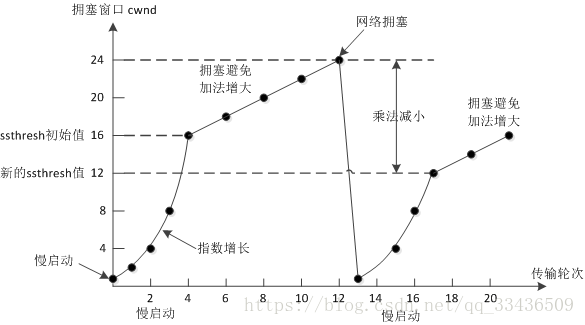
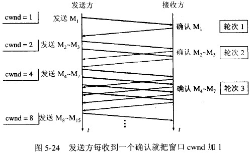
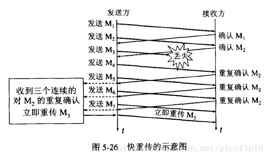

# 操作系统

## 1. 进程

进程就是正在执行的程序，是操作系统在资源分配的基本单位。一般来说，进程包括指令、数据和PCB。

**守护进程**是运行在后台的特殊进程，独立于控制终端的，并周期性地执行某些任务。

## 2. 僵尸进程

**僵尸进程**是子进程先于父进程退出后，子进程的PCB需要其父进程释放，但是父进程并没有释放子进程的 PCB，这样的子进程就称为僵尸进程。**僵尸进程实际上是一个已经死掉但并未释放 PBC 的进程**。

+ 僵尸进程的产生

  一个进程在调用 exit 命令结束自己的生命周期时，它并没有真正的被销毁，而是留下一个称为**僵尸进程（Zombie）** 的数据结构（系统调用 exit 的作用是使进程退出，但也仅仅限于将一个正常的进程变成一个僵尸进程，并不能将其完全销毁）。在 Linux 进程的状态中，僵尸进程是非常特殊的一种，它已经放弃了几乎所有内存空间，没有任何可执行代码，也不能被调度，仅仅在进程列表中保留一个位置，记载该进程的退出状态等信息供其他进程收集，除此之外，僵尸进程不再占有任何内存空间。这个僵尸进程需要它的父进程来为它收尸，如果他的父进程没有处理这个僵尸进程的措施，那么它就一直保持僵尸状态，如果这时父进程结束了，那么init进程自动会接手这个子进程，为它收尸，它还是能被清除的。但是如果如果父进程是一个循环，不会结束，那么子进程就会一直保持僵尸状态，这就是为什么系统中有时会有很多的僵尸进程。

+ 僵尸进程的危害

  如果有大量的僵尸进程驻在系统之中，必然消耗大量的系统资源。但是系统资源是有限的，因此当僵尸进程达到一定数目时，系统因缺乏资源而导致奔溃。所以在实际编程中，避免和防范僵尸进程的产生显得尤为重要。

+ 如何避免僵尸进程？=================

  + 父进程通过wait和waitpid等函数等待子进程结束；
  + 使用signal函数为SIGCHLD安装handler；
  + 父进程不关心子进程的结束，则交给内核处理；
  + fork两次，回收子进程，并将孙进程交给１号进程（initi进程）。

## 3. 孤儿进程

一个父进程退出，而它的一个或多个子进程还在运行，那么那些子进程将成为孤儿进程。孤儿进程将被 init 进程（pid=1）所收养，并由init进程对它们完成状态收集工作。

**孤儿进程与僵尸进程的区别：**

孤儿进程与僵尸进程不同的是，由于父进程已经死亡，系统会帮助父进程回收处理孤儿进程。所以孤儿进程实际上是不占用资源的，因为它终究是被系统回收了。不会像僵尸进程那样占用 ID，损害运行系统。

## 4. 线程

线程是进程内部不同的执行路径，是操作系统独立调度的基本单位。一个进程中可以有多个线程，他们共享进程资源。

比如说，微信和浏览器是两个进程，浏览器进程里面有很多线程，例如 HTTP 请求线程、事件响应线程、渲染线程等等，线程的并发执行使得在浏览器中点击一个新链接从而发起 HTTP 请求时，浏览器还可以响应用户的其它事件。

+ **两种线程**
  + 用户线程、内核级线程

## 5. 进程和线程的区别？

+ 进程是资源分配的最小单位，线程是CPU调度的最小单位
+ 进程就是**正在执行的程序**，线程是进程内部的**不同的执行路径**。
+ 一个程序至少有一个进程，一个进程至少有一个线程。
+ 进程有自己的独立地址空间，每启动一个进程，系统就会为它分配地址空间；而线程是共享进程中的数据、地址空间的。
+ 多进程程序更健壮，多线程程序只要有一个线程死掉，整个进程也死掉了；而一个进程死掉并不会对另外一个进程造成影响，因为进程有自己独立的地址空间。
+ 线程之间的通信更方便，同一进程下的线程共享全局变量、静态变量等[数据](https://www.nowcoder.com/jump/super-jump/word?word=数据)
+ 进程上下文切换开销大，线程开销小

有个形象的例子区分进程和线程：车间和工人或者高速路和车道。

### 同一进程中的线程可以共享哪些数据？

- 进程代码段
- 进程的公有数据（全局变量、静态变量...）
- 进程打开的文件描述符
- 进程的当前目录
- 信号处理器/信号处理函数：对收到的信号的处理方式
- 进程ID与进程组ID

### 线程独占哪些资源？

- 线程ID
- 一组寄存器的值
- 线程自身的栈（堆是共享的）
- 错误返回码：线程可能会产生不同的错误返回码，一个线程的错误返回码不应该被其它线程修改；
- 信号掩码/信号屏蔽字(Signal mask)：表示是否屏蔽/阻塞相应的信号（SIGKILL,SIGSTOP除外）

## 6. 进程状态

+ 在五状态模型里面，进程一共有 5 中状态，分别是**创建、就绪、运行、终止、阻塞**。
+ 运行状态就是进程正在 CPU 上运行。在单处理机环境下，每一时刻最多只有一个进程处于运行状态。
+ 就绪状态就是说进程已经处于准备运行的状态，即进程获得了除CPU之外的一切所需资源，一旦得到CPU即可运行。
+ 阻塞状态就是进程正在等待某一事件而暂停运行，比如等待某资源为可用或等待I/O完成。即使CPU空闲，该进程也不能运行。

运行态→阻塞态：往往是由于等待外设，等待主存等资源分配或等待人工干预而引起的。

阻塞态→就绪态：则是等待的条件已满足，只需分配到处理器后就能运行。

运行态→就绪态：不是由于自身原因，而是由外界原因使运行状态的进程让出处理器，这时候就变成就绪态。例如时间片用完，或有更高优先级的进程来抢占处理器等。

就绪态→运行态：系统按某种策略选中就绪队列中的一个进程占用处理器，此时就变成了运行态。

## 7. 并发和并行

+ 并发就是在一段时间内，多个任务都会被处理；但在同一时刻，只有一个任务在执行。单核处理器可以做到并发。比如有两个进程A和B，A运行一个时间片之后，切换到B，B运行一个时间片之后又切换到A。因为切换速度足够快，所以宏观上表现为一段时间内能同时运行多个程序。
+ 并行就是在同一时刻，有多个任务在执行。这个需要多核处理器才能完成，在微观上就能同时执行多条指令，不同的程序被放到不同的处理器上运行，这个是物理上的多个进程同时进行。

## 8. 进程调度算法

**调度算法**是指根据系统的资源分配策略所规定的资源分配算法。

+ 先来先服务算法

  + 非抢占式的调度算法，按照请求的顺序进行调度。
  + 有利于长作业，但不利于短作业，因为短作业必须一直等待前面的长作业执行完毕才能执行，而长作业又需要执行很长时间，造成了短作业等待时间过长。另外，对`I/O`密集型进程也不利，因为这种进程每次进行`I/O`操作之后又得重新排队。

+ 短作业优先

  + 非抢占式的调度算法，按估计运行时间最短的顺序进行调度。
  + 长作业有可能会饿死，处于一直等待短作业执行完毕的状态。因为如果一直有短作业到来，那么长作业永远得不到调度。

+ 最短剩余时间优先

  + 最短作业优先的抢占式版本，按剩余运行时间的顺序进行调度。 当一个新的作业到达时，其整个运行时间与当前进程的剩余时间作比较。如果新的进程需要的时间更少，则挂起当前进程，运行新的进程。否则新的进程等待。

+ 时间片轮转

  + 将所有就绪进程按 `FCFS` 的原则排成一个队列，每次调度时，把 `CPU` 时间分配给队首进程，该进程可以执行一个时间片。当时间片用完时，由计时器发出时钟中断，调度程序便停止该进程的执行，并将它送往就绪队列的末尾，同时继续把 `CPU` 时间分配给队首的进程。
  + 时间片轮转算法的效率和时间片的大小有很大关系：
    - 因为进程切换都要保存进程的信息并且载入新进程的信息，如果时间片太小，会导致进程切换得太频繁，在进程切换上就会花过多时间。 
    - 而如果时间片过长，那么实时性就不能得到保证。

+ 优先级调度

  + 为每个进程分配一个优先级，按优先级进行调度。

    为了防止低优先级的进程永远等不到调度，可以随着时间的推移增加等待进程的优先级。

  

  **抢占式调度、非抢占式调度：**

  + **抢占式**就是说操作系统将正在运行的进程强行暂停，由调度器将`CPU`分配给其他就绪进程。
  + **非抢占式**是调度器一旦把处理机分配给某进程后便让它一直运行下去，直到进程完成或发生进程调度进程调度某事件而阻塞时，才把处理机分配给另一个进程。

## 9. 什么是进程和线程的亲缘性？

进程/线程只在某个cpu核上运行，避免因切换带来的CPU的L1/L2 cache失效。

## 10. 什么是协程？

**协程**是用户态的轻量级线程，是一种比线程更加轻量级的存在，协程不被操作系统内核管理，完全由程序控制。

**协程的优点**

1）没有线程切换开销；

2）单线程无需对共享资源加锁机制。

其**缺点**也显而易见，就是无法利用多核资源。**协程本质还是单线程，无法直接利用多核处理器，需要配合进程实现**。

## 11. 死锁

两个线程或两个以上线程都在等待对方执行完毕才能继续往下执行的时候就发生了死锁。结果就是这些线程都陷入了无限的等待中。

原因：

+ 系统提供的资源太少了，远不能满足并发进程对资源的需求
+ 进程推进顺序不合适，互相占有彼此需要的资源，同时请求对方占有的资源，往往是程序设计不合理

## 12. 死锁产生的必要条件

需要同时具有以下四个条件：

+ **互斥条件：**即某个资源在一段时间内只能由一个进程占有，不能同时被两个或两个以上的进程占有。
+ **不可抢占条件**：进程所获得的资源在未使用完毕之前，资源申请者不能强行的从资源占有者手中夺取资源，而只能由该资源的占有者进程自行释放。
+ **占有且等待条件：**已经得到了某个资源的进程可以再请求新的资源。
+ **循环等待条件：**有两个或者两个以上的进程组成一条环路，该环路中的每个进程都在等待下一个进程所占有的资源。

## 13. 处理死锁的四种方法

（1）死锁预防：通过确保死锁的一个必要条件不会满足，保证不会发生死锁
（2）死锁检测：允许死锁的发生，但是可以通过系统设置的检测结构及时的检测出死锁的发生，采取一些措施，	将死锁清除掉
（3）死锁避免：在资源分配过程中，使用某种方法避免系统进入不安全的状态，从而避免发生死锁
（4）死锁解除：与死锁检测相配套的一种措施。当检测到系统中已发生死锁，需将进程从死锁状态中解脱出来。

+ **死锁预防：破坏三个条件（互斥是非共享设备特性，无法更改）。**

+ **死锁避免：**

  ​		两种死锁避免算法

  + 进程启动拒绝：如果一个进程的请求会导致死锁，则不启动该进程。
  + 资源分配拒绝：如果一个进程增加的资源请求会导致死锁，则不允许此分配 (银行家算法)。

+ **死锁检测**

  死锁检测的方法：

  + 在资源分配图中，找到不会阻塞又不独立的进程结点，使该进程获得其所需资源并运行，运行完毕后，再释放其所占有的全部资源。也就是消去该进程结点的请求边和分配边。
  + 使用上面的算法进行一系列简化，若能消去所有边，则表示不会出现死锁，否则会出现死锁。

+ **死锁解除**

  + 撤销死锁进程
  + 剥夺死锁进程的资源，直到不存在死锁
  + 鸵鸟算法（即直接忽略，当做什么都没发生，说出来可能不信，绝大多数的操作系统选择这个方法）。

## 14. 进程同步的方式

**临界区**
通过对多线程的串行化来访问公共资源或一段代码，速度快，适合控制数据访问。在任意时刻只允许一个线程对共享资源进行访问，如果有多个线程试图访问公共资源，那么在有一个线程进入后，其他试图访问公共资源的线程将被挂起，并一直等到进入临界区的线程离开，临界区在被释放后，其他线程才可以抢占。
优点：保证在某一时刻只有一个线程能访问数据的简便办法。
缺点：虽然临界区同步速度很快，但却只能用来同步当前进程内的线程，而不可用来同步多个进程中的线程。

**互斥量**
采用互斥对象机制。只有拥有互斥对象的线程才有访问公共资源的权限，因为互斥对象只有一个，所以能保证公共资源不会同时被多个线程访问。互斥不仅能实现同一应用程序的公共资源安全共享，还能实现不同应用程序的公共资源安全共享。

**信号量**
为控制一个具有有限数量用户资源而设计。它允许多个线程在同一时刻访问同一资源，但是需要限制在同一时刻访问此资源的最大线程数目。互斥量是信号量的一种特殊情况，当信号量的最大资源数 = 1 就是互斥量了。
**PV 操作**：

对于 P 操作申请资源，如果执行操作后信号量小于 0，那么执行该操作的进程就会阻塞，否则继续执行；
对于 V 操作释放资源，如果操作之后的信号量小于等于 0，那么就会从阻塞队列唤醒一个进程。
**管程**
管程使用的是面向对象思想，是一种集中式同步进程。将表示共享资源的数据结构还有相关的操作，包括同步机制，都集中并封装到一起。所有进程都只能通过管程间接访问临界资源，而管程只允许一个进程进入并执行操作，从而实现进程互斥。
管程中设置了多个条件变量，表示多个进程被阻塞或挂起的条件。对条件变量执行 wait () 操作会导致调用进程阻塞，把管程让出来给另一个进程持有。signal () 操作用于唤醒被阻塞的进程。
管程有一个重要特性，就是在一个时刻只能有一个进程使用管程。进程在无法继续执行的时候不能一直占用管程，否则其它进程永远不能使用管程。

## 15. 进程间通信的方式 (IPC)

+ 管道：**所谓的管道，就是内核里面的一串缓存**。从管道的一段写入的数据，实际上是缓存在内核中的，另一端读取，也就是从内核中读取这段数据。另外，管道传输的数据是无格式的流且大小受限。
+ 消息队列：**消息队列是保存在内核中的消息链表**，在发送数据时，会分成一个一个独立的数据单元，也就是消息体（数据块）
+ 共享内存：**共享内存的机制，就是拿出一块虚拟地址空间来，映射到相同的物理内存中**。
+ 信号量：为了防止多进程竞争共享资源，而造成的数据错乱，所以需要保护机制，使得共享的资源，在任意时刻只能被一个进程访问。正好，**信号量**就实现了这一保护机制。
+ 信号量
+ 信号：**对于异常情况下的工作模式，就需要用「信号」的方式来通知进程。**信号是进程间通信机制中**唯一的异步通信机制**。
+ Socket：管道、消息队列、共享内存、信号量和信号都是在同一台主机上进行进程间通信，那要想**跨网络与不同主机上的进程之间通信，就需要 Socket 通信了。**实际上，Socket 通信不仅可以跨网络与不同主机的进程间通信，还可以在同主机上进程间通信。

## 16. 磁盘调度算法

+ 先来先服务
  + 按照磁盘请求的顺序进行调度。
  + 优点是公平和简单。缺点也很明显，因为未对寻道做任何优化，使平均寻道时间可能较长。

+ 最短寻道时间优先

  + 优先调度与当前磁头所在磁道距离最近的磁道。

  + 虽然平均寻道时间比较低，但是不够公平。如果新到达的磁道请求总是比一个在等待的磁道请求近，那么在等待的磁道请求会一直等待下去，也就是出现饥饿现象。一般来说，两端的磁道请求更容易出现饥饿现象。

    

+ 电梯算法
  + 也叫 SCAN 扫描算法。就是说读写磁头总是保持一个方向运行，直到该方向没有请求为止，然后改变运行方向。
  + 因为考虑了移动方向，因此所有的磁盘请求都会被满足，解决了最短寻道时间优先的饥饿问题。

## 17. 虚拟内存

## 18. 什么是用户态和内核态？

为了限制不同程序的访问能力，防止一些程序访问其它程序的内存数据，CPU划分了用户态和内核态两个权限等级。

## 进程的异常控制流：陷阱、中断、异常和信号 

# 计算机网络

## NAT协议

**NAT协议是将IP数据报头中的IP地址转换为另外一个IP地址的过程，主要用于实现私有网络访问公有网络的功能**。这种通过使用少量的IP地址代表较多的私有IP地址的方式，将有助于减少IP地址空间的枯竭。

## 二层交换机和三层交换机的区别

## osi七层模型

物理层、数据链路层、网络层、传输层、表示层、会话层、应用层

## TCP报文头部结构

## IP 报文头部的格式

## 三次握手

- 第一次握手：Client将SYN置1，随机产生一个初始序列号seq发送给Server，进入SYN_SENT状态；
- 第二次握手：Server收到Client的SYN=1之后，知道客户端请求建立连接，将自己的SYN置1，ACK置1，产生一个acknowledge number=sequence number+1，并随机产生一个自己的初始序列号，发送给客户端；进入SYN_RCVD状态；
- 第三次握手：客户端检查acknowledge number是否为序列号+1，ACK是否为1，检查正确之后将自己的ACK置为1，产生一个acknowledge number=服务器发的序列号+1，发送给服务器；进入ESTABLISHED状态；服务器检查ACK为1和acknowledge number为序列号+1之后，也进入ESTABLISHED状态；完成三次握手，连接建立。

### TCP建立连接可以两次握手吗？为什么?

不可以。有两个原因：

+ 首先，可能会出现**已失效的连接请求报文段又传到了服务器端**。
  + client 发出的第一个连接请求报文段并没有丢失，而是在某个网络结点长时间的滞留了，以致延误到连接释放以后的某个时间才到达 server。本来这是一个早已失效的报文段。但 server 收到此失效的连接请求报文段后，就误认为是 client 再次发出的一个新的连接请求。于是就向 client 发出确认报文段，同意建立连接。假设不采用 “三次握手”，那么只要 server 发出确认，新的连接就建立了。由于现在 client 并没有发出建立连接的请求，因此不会理睬 server 的确认，也不会向 server 发送数据。但 server 却以为新的运输连接已经建立，并一直等待 client 发来数据。这样，server 的很多资源就白白浪费掉了。采用 “三次握手” 的办法可以防止上述现象发生。例如刚才那种情况，client 不会向 server 的确认发出确认。server 由于收不到确认，就知道 client 并没有要求建立连接。
+ 其次，两次握手无法保证Client正确接收第二次握手的报文（Server无法确认Client是否收到），也无法保证Client和Server之间成功互换初始序列号。

### 可以采用四次握手吗？为什么？

可以。但是会降低传输的效率。

四次握手是指：第二次握手：Server只发送ACK和acknowledge number；而Server的SYN和初始序列号在第三次握手时发送；原来协议中的第三次握手变为第四次握手。出于优化目的，四次握手中的二、三可以合并。

### 第三次握手中，如果客户端的ACK未送达服务器，会怎样？

Server端：
由于Server没有收到ACK确认，因此会重发之前的SYN+ACK（默认重发五次，之后自动关闭连接进入CLOSED状态），Client收到后会重新传ACK给Server。

Client端，两种情况：

1. 在Server进行超时重发的过程中，如果Client向服务器发送数据，数据头部的ACK是为1的，所以服务器收到数据之后会读取 ACK number，进入 establish 状态
2. 在Server进入CLOSED状态之后，如果Client向服务器发送数据，服务器会以RST包应答。

### 如果已经建立了连接，但客户端出现了故障怎么办？

服务器每收到一次客户端的请求后都会重新复位一个计时器，时间通常是设置为2小时，若两小时还没有收到客户端的任何数据，服务器就会发送一个探测报文段，以后每隔75秒钟发送一次。若一连发送10个探测报文仍然没反应，服务器就认为客户端出了故障，接着就关闭连接。

### 初始序列号是什么？

TCP连接的一方A，随机选择一个32位的序列号（Sequence Number）作为发送数据的初始序列号（Initial Sequence Number，ISN），比如为1000，以该序列号为原点，对要传送的数据进行编号：1001、1002...三次握手时，把这个初始序列号传送给另一方B，以便在传输数据时，B可以确认什么样的数据编号是合法的；同时在进行数据传输时，A还可以确认B收到的每一个字节，如果A收到了B的确认编号（acknowledge number）是2001，就说明编号为1001-2000的数据已经被B成功接受。

## 四次挥手

- 第一次挥手：Client将FIN置为1，发送一个序列号seq给Server；进入FIN_WAIT_1状态；
- 第二次挥手：Server收到FIN之后，发送一个ACK=1，acknowledge number=收到的序列号+1；进入CLOSE_WAIT状态。此时客户端已经没有要发送的数据了，但仍可以接受服务器发来的数据。
- 第三次挥手：Server将FIN置1，发送一个序列号给Client；进入LAST_ACK状态；
- 第四次挥手：Client收到服务器的FIN后，进入TIME_WAIT状态；接着将ACK置1，发送一个acknowledge number=序列号+1给服务器；服务器收到后，确认acknowledge number后，变为CLOSED状态，不再向客户端发送数据。客户端等待2*MSL（报文段最长寿命）时间后，也进入CLOSED状态。完成四次挥手。

### 为什么不能把服务器发送的ACK和FIN合并起来，变成三次挥手（CLOSE_WAIT状态意义是什么）？

因为服务器收到客户端断开连接的请求时，可能还有一些数据没有发完，这时先回复ACK，表示接收到了断开连接的请求。等到数据发完之后再发FIN，断开服务器到客户端的数据传送。

### 如果第二次挥手时服务器的ACK没有送达客户端，会怎样？

客户端没有收到ACK确认，会重新发送FIN请求。

### 客户端TIME_WAIT状态的意义是什么？

第四次挥手时，客户端发送给服务器的ACK有可能丢失，TIME_WAIT状态就是用来重发可能丢失的ACK报文。如果Server没有收到ACK，就会重发FIN，如果Client在2*MSL的时间内收到了FIN，就会重新发送ACK并再次等待2MSL，防止Server没有收到ACK而不断重发FIN。

MSL(Maximum Segment Lifetime)，指一个片段在网络中最大的存活时间，2MSL就是一个发送和一个回复所需的最大时间。如果直到2MSL，Client都没有再次收到FIN，那么Client推断ACK已经被成功接收，则结束TCP连接。

## 路由交换协议

## TCP 流量控制

使用滑动窗口协议实现流量控制。防止发送方发送速率太快，接收方缓存区不够导致溢出。接收方会维护一个接收窗口 receiver window（窗口大小单位是字节），接受窗口的大小是根据自己的资源情况动态调整的，在返回ACK时将接受窗口大小放在TCP报文中的窗口字段告知发送方。发送窗口的大小不能超过接受窗口的大小，只有当发送方发送并收到确认之后，才能将发送窗口右移。

发送窗口的上限为接受窗口和拥塞窗口中的较小值。接受窗口表明了接收方的接收能力，拥塞窗口表明了网络的传送能力。

##### 什么是零窗口（接收窗口为0时会怎样）？

如果接收方没有能力接收数据，就会将接收窗口设置为0，这时发送方必须暂停发送数据，但是会启动一个持续计时器(persistence timer)，到期后发送一个大小为1字节的探测数据包，以查看接收窗口状态。如果接收方能够接收数据，就会在返回的报文中更新接收窗口大小，恢复数据传送。

## TCP的拥塞控制是怎么实现的？

拥塞控制主要由四个算法组成：**慢启动（Slow Start）、拥塞避免（Congestion voidance）、快重传 （Fast Retransmit）、快恢复（Fast Recovery）**

1. 慢启动：刚开始发送数据时，先把拥塞窗口（congestion window）设置为一个最大报文段MSS的数值，每收到一个新的确认报文之后，就把拥塞窗口加1个MSS。这样每经过一个传输轮次（或者说是每经过一个往返时间RTT），拥塞窗口的大小就会加倍

2. 拥塞避免：当拥塞窗口的大小达到慢开始门限(slow start threshold)时，开始执行拥塞避免算法，拥塞窗口大小不再指数增加，而是线性增加，即每经过一个传输轮次只增加1MSS.

> 无论在慢开始阶段还是在拥塞避免阶段，只要发送方判断网络出现拥塞（其根据就是没有收到确认），就要把慢开始门限ssthresh设置为出现拥塞时的发送方窗口值的一半（但不能小于2）。然后把拥塞窗口cwnd重新设置为1，执行慢开始算法。**（这是不使用快重传的情况）**

3. 快重传：快重传要求接收方在收到一个失序的报文段后就立即发出**重复确认**（为的是使发送方及早知道有报文段没有到达对方）而不要等到自己发送数据时捎带确认。快重传算法规定，发送方只要一连收到三个重复确认就应当立即重传对方尚未收到的报文段，而不必继续等待设置的重传计时器时间到期。

4. 快恢复：当发送方连续收到三个重复确认时，就把慢开始门限减半，然后执行拥塞避免算法。不执行慢开始算法的原因：因为如果网络出现拥塞的话就不会收到好几个重复的确认，所以发送方认为现在网络可能没有出现拥塞。
也有的快重传是把开始时的拥塞窗口cwnd值再增大一点，即等于 ssthresh + 3*MSS 。这样做的理由是：既然发送方收到三个重复的确认，就表明有三个分组已经离开了网络。这三个分组不再消耗网络的资源而是停留在接收方的缓存中。可见现在网络中减少了三个分组。因此可以适当把拥塞窗口扩大些。

## TCP如何最大利用带宽？

### TCP速率受到三个因素影响

- 窗口：即滑动窗口大小，见[TCP如何实现流量控制？](https://github.com/wolverinn/Waking-Up/blob/master/Computer Network.md#TCP如何实现流量控制)
- 带宽：这里带宽是指单位时间内从发送端到接收端所能通过的“最高数据率”，是一种硬件限制。TCP发送端和接收端的数据传输数不可能超过两点间的带宽限制。发送端和接收端之间带宽取所通过线路的带宽最小值（如通过互联网连接）。
- RTT：即Round Trip Time，表示从发送端到接收端的一去一回需要的时间，TCP在数据传输过程中会对RTT进行采样（即对发送的数据包及其ACK的时间差进行测量，并根据测量值更新RTT值），TCP根据得到的RTT值更新RTO值，即Retransmission TimeOut，就是重传间隔，发送端对每个发出的数据包进行计时，如果在RTO时间内没有收到所发出的数据包的对应ACK，则任务数据包丢失，将重传数据。一般RTO值都比采样得到的RTT值要大。

## TCP 和 UDP 区别

1. TCP是面向连接的，UDP是无连接的；
2. TCP是可靠的，UDP不可靠；
3. TCP只支持点对点通信，UDP支持一对一、一对多、多对一、多对多；
4. TCP是面向字节流的，UDP是面向报文的；
5. TCP有拥塞控制机制，UDP没有。网络出现的拥塞不会使源主机的发送速率降低，这对某些实时应用是很重要的，比如媒体通信，游戏；
6. TCP首部开销（20字节）比UDP首部开销（8字节）要大
7. UDP 的主机不需要维持复杂的连接状态表

### 什么时候选择TCP，什么时候选UDP？

对某些实时性要求比较高的情况，选择UDP，比如游戏，媒体通信，实时视频流（直播），即使出现传输错误也可以容忍；其它大部分情况下，HTTP都是用TCP，因为要求传输的内容可靠，不出现丢失;

### HTTP可以使用UDP吗？

HTTP不可以使用UDP，HTTP需要基于可靠的传输协议，而UDP不可靠

注：**http 3.0 使用udp实现** https://zh.wikipedia.org/wiki/HTTP/3

## TCP如何保证传输的可靠性

1. 数据包校验
2. 对失序数据包重新排序（TCP报文具有序列号）
3. 丢弃重复数据
4. 应答机制：接收方收到数据之后，会发送一个确认（通常延迟几分之一秒）；
5. 超时重发：发送方发出数据之后，启动一个定时器，超时未收到接收方的确认，则重新发送这个数据；
6. 流量控制：确保接收端能够接收发送方的数据而不会缓冲区溢出;

## HTTP和HTTPS有什么区别？

1. 端口不同：HTTP使用的是80端口，HTTPS使用443端口；
2. HTTP（超文本传输协议）信息是明文传输，HTTPS运行在SSL(Secure Socket Layer)之上，添加了加密和认证机制，更加安全；
3. HTTPS由于加密解密会带来更大的CPU和内存开销；
4. HTTPS通信需要证书，一般需要向证书颁发机构（CA）购买

### Https的连接过程？

1. 客户端向服务器发送请求，同时发送客户端支持的一套加密规则（包括对称加密、非对称加密、摘要算法）；
2. 服务器从中选出一组加密算法与HASH算法，并将自己的身份信息以证书的形式发回给浏览器。证书里面包含了网站地址，**加密公钥**（用于非对称加密），以及证书的颁发机构等信息（证书中的私钥只能用于服务器端进行解密）；
3. 客户端验证服务器的合法性，包括：证书是否过期，CA 是否可靠，发行者证书的公钥能否正确解开服务器证书的“发行者的数字签名”，服务器证书上的域名是否和服务器的实际域名相匹配；
4. 如果证书受信任，或者用户接收了不受信任的证书，浏览器会生成一个**随机密钥**（用于对称算法），并用服务器提供的公钥加密（采用非对称算法对密钥加密）；使用Hash算法对握手消息进行**摘要**计算，并对摘要使用之前产生的密钥加密（对称算法）；将加密后的随机密钥和摘要一起发送给服务器；
5. 服务器使用自己的私钥解密，得到对称加密的密钥，用这个密钥解密出Hash摘要值，并验证握手消息是否一致；如果一致，服务器使用对称加密的密钥加密握手消息发给浏览器；
6. 浏览器解密并验证摘要，若一致，则握手结束。之后的数据传送都使用对称加密的密钥进行加密

总结：非对称加密算法用于在握手过程中加密生成的密码；对称加密算法用于对真正传输的数据进行加密；HASH算法用于验证数据的完整性。

### 输入 [www.baidu.com，怎么变成](http://www.baidu.xn--com%2C-yj5fs80afjwtvd/) [https://www.baidu.com](https://www.baidu.com/) 的，怎么确定用HTTP还是HTTPS？

[你访问的网站是如何自动切换到 HTTPS 的？](https://www.sohu.com/a/136637876_487516)

一种是原始的302跳转，服务器把所有的HTTp流量跳转到HTTPS。但这样有一个漏洞，就是中间人可能在第一次访问站点的时候就劫持。 解决方法是引入HSTS机制，用户浏览器在访问站点的时候强制使用HTTPS。

### HTTPS连接的时候，怎么确定收到的包是服务器发来的（中间人攻击）？

1.验证域名、有效期等信息是否正确。证书上都有包含这些信息，比较容易完成验证；

2.判断证书来源是否合法。每份签发证书都可以根据验证链查找到对应的根证书，操作系统、浏览器会在本地存储权威机构的根证书，利用本地根证书可以对对应机构签发证书完成来源验证；

3.判断证书是否被篡改。需要与 CA 服务器进行校验；

4.判断证书是否已吊销。通过CRL（Certificate Revocation List 证书注销列表）和 OCSP（Online Certificate Status Protocol 在线证书状态协议）实现，其中 OCSP 可用于第3步中以减少与 CA 服务器的交互，提高验证效率

## GET与POST的区别？

1. GET是幂等的，即读取同一个资源，总是得到相同的数据，POST不是幂等的；
2. GET一般用于从服务器获取资源，而POST有可能改变服务器上的资源；
3. 请求形式上：GET请求的数据附在URL之后，在HTTP请求头中；POST请求的数据在请求体中；
4. 安全性：GET请求可被缓存、收藏、保留到历史记录，且其请求数据明文出现在URL中。POST的参数不会被保存，安全性相对较高；
5. GET只允许ASCII字符，POST对数据类型没有要求，也允许二进制数据；
6. GET的长度有限制（操作系统或者浏览器），而POST数据大小无限制;

## Session与Cookie的区别？

Session是服务器端保持状态的方案，Cookie是客户端保持状态的方案

Cookie保存在客户端本地，客户端请求服务器时会将Cookie一起提交；Session保存在服务端，通过检索Sessionid查看状态。保存Sessionid的方式可以采用Cookie，如果禁用了Cookie，可以使用URL重写机制（把会话ID保存在URL中）。

## HTTP请求有哪些常见状态码？

1. 2xx状态码：操作成功。200 OK
2. 3xx状态码：重定向。301 永久重定向；302暂时重定向
3. 4xx状态码：客户端错误。400 Bad Request；401 Unauthorized；403 Forbidden；404 Not Found；
4. 5xx状态码：服务端错误。500服务器内部错误；501服务不可用

## HTTP/1.1  HTTP/2  HTTP/3区别

# 数据结构

# MySQL
