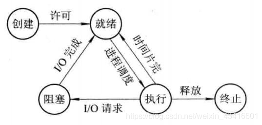

# 操作系统

## 1. 进程

进程就是正在执行的程序，是操作系统在资源分配的基本单位。一般来说，进程包括指令、数据和PCB。

**守护进程**是运行在后台的特殊进程，独立于控制终端的，并周期性地执行某些任务。

## 2. 僵尸进程

**僵尸进程**是子进程先于父进程退出后，子进程的PCB需要其父进程释放，但是父进程并没有释放子进程的 PCB，这样的子进程就称为僵尸进程。**僵尸进程实际上是一个已经死掉但并未释放 PBC 的进程**。

+ 僵尸进程的产生

  一个进程在调用 exit 命令结束自己的生命周期时，它并没有真正的被销毁，而是留下一个称为**僵尸进程（Zombie）** 的数据结构（系统调用 exit 的作用是使进程退出，但也仅仅限于将一个正常的进程变成一个僵尸进程，并不能将其完全销毁）。在 Linux 进程的状态中，僵尸进程是非常特殊的一种，它已经放弃了几乎所有内存空间，没有任何可执行代码，也不能被调度，仅仅在进程列表中保留一个位置，记载该进程的退出状态等信息供其他进程收集，除此之外，僵尸进程不再占有任何内存空间。这个僵尸进程需要它的父进程来为它收尸，如果他的父进程没有处理这个僵尸进程的措施，那么它就一直保持僵尸状态，如果这时父进程结束了，那么init进程自动会接手这个子进程，为它收尸，它还是能被清除的。但是如果如果父进程是一个循环，不会结束，那么子进程就会一直保持僵尸状态，这就是为什么系统中有时会有很多的僵尸进程。

+ 僵尸进程的危害

  如果有大量的僵尸进程驻在系统之中，必然消耗大量的系统资源。但是系统资源是有限的，因此当僵尸进程达到一定数目时，系统因缺乏资源而导致奔溃。所以在实际编程中，避免和防范僵尸进程的产生显得尤为重要。

+ 如何避免僵尸进程？=================

  + 父进程通过wait和waitpid等函数等待子进程结束；
  + 使用signal函数为SIGCHLD安装handler；
  + 父进程不关心子进程的结束，则交给内核处理；
  + fork两次，回收子进程，并将孙进程交给１号进程（initi进程）。

## 3. 孤儿进程

一个父进程退出，而它的一个或多个子进程还在运行，那么那些子进程将成为孤儿进程。孤儿进程将被 init 进程（pid=1）所收养，并由init进程对它们完成状态收集工作。

**孤儿进程与僵尸进程的区别：**

孤儿进程与僵尸进程不同的是，由于父进程已经死亡，系统会帮助父进程回收处理孤儿进程。所以孤儿进程实际上是不占用资源的，因为它终究是被系统回收了。不会像僵尸进程那样占用 ID，损害运行系统。

## 4. 线程

线程是进程内部不同的执行路径，是操作系统独立调度的基本单位。一个进程中可以有多个线程，他们共享进程资源。

比如说，微信和浏览器是两个进程，浏览器进程里面有很多线程，例如 HTTP 请求线程、事件响应线程、渲染线程等等，线程的并发执行使得在浏览器中点击一个新链接从而发起 HTTP 请求时，浏览器还可以响应用户的其它事件。

+ **两种线程**
  + 用户线程、内核级线程

## 5. 进程和线程的区别？

+ 进程是资源分配的最小单位，线程是CPU调度的最小单位
+ 进程就是**正在执行的程序**，线程是进程内部的**不同的执行路径**。
+ 一个程序至少有一个进程，一个进程至少有一个线程。
+ 进程有自己的独立地址空间，每启动一个进程，系统就会为它分配地址空间；而线程是共享进程中的数据、地址空间的。
+ 多进程程序更健壮，多线程程序只要有一个线程死掉，整个进程也死掉了；而一个进程死掉并不会对另外一个进程造成影响，因为进程有自己独立的地址空间。
+ 线程之间的通信更方便，同一进程下的线程共享全局变量、静态变量等[数据](https://www.nowcoder.com/jump/super-jump/word?word=数据)
+ 进程上下文切换开销大，线程开销小

有个形象的例子区分进程和线程：车间和工人或者高速路和车道。

## 6. 进程状态

+ 在五状态模型里面，进程一共有 5 中状态，分别是**创建、就绪、运行、终止、阻塞**。
+ 运行状态就是进程正在 CPU 上运行。在单处理机环境下，每一时刻最多只有一个进程处于运行状态。
+ 就绪状态就是说进程已经处于准备运行的状态，即进程获得了除CPU之外的一切所需资源，一旦得到CPU即可运行。
+ 阻塞状态就是进程正在等待某一事件而暂停运行，比如等待某资源为可用或等待I/O完成。即使CPU空闲，该进程也不能运行。

运行态→阻塞态：往往是由于等待外设，等待主存等资源分配或等待人工干预而引起的。

阻塞态→就绪态：则是等待的条件已满足，只需分配到处理器后就能运行。

运行态→就绪态：不是由于自身原因，而是由外界原因使运行状态的进程让出处理器，这时候就变成就绪态。例如时间片用完，或有更高优先级的进程来抢占处理器等。

就绪态→运行态：系统按某种策略选中就绪队列中的一个进程占用处理器，此时就变成了运行态。

## 7. 并发和并行

+ 并发就是在一段时间内，多个任务都会被处理；但在同一时刻，只有一个任务在执行。单核处理器可以做到并发。比如有两个进程A和B，A运行一个时间片之后，切换到B，B运行一个时间片之后又切换到A。因为切换速度足够快，所以宏观上表现为一段时间内能同时运行多个程序。
+ 并行就是在同一时刻，有多个任务在执行。这个需要多核处理器才能完成，在微观上就能同时执行多条指令，不同的程序被放到不同的处理器上运行，这个是物理上的多个进程同时进行。

## 8. 进程调度算法

# 计算机网络

## NAT协议

## 二层交换机和三层交换机的区别

## ios七层模型

## 三次握手

## 四次挥手

## 路由交换协议