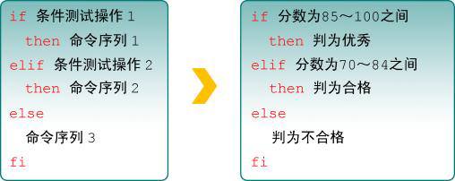

# Linux学习

## 《Linux就该这么学》第2版

### 常用命令

~~~bash
cut -d <分隔符> -f <第几列> 文件名 
~~~

### 标准输入输出及错误输出

> 标准输入重定向（STDIN，文件描述符为0）
>
> 标准输出重定向（STDOUT，文件描述符为1）
>
> 错误输出重定向（STDERR，文件描述符为2）

**不区分标准输出和错误输出，只要命令有输出信息则全部追加写入到文件中，这就要用到&>>操作符**

### 管道符

> 管道符的作用：**把前一个命令原本要输出在屏幕上的内容作为第二个命令的标准输入**

~~~bash
`tee`命令 

Usage: tee [OPTION]... [FILE]...                                                                                                                                          

Copy standard input to each FILE, and also to standard output. 
既可以在屏幕上显示输出结果，而且还把输出结果保存到某一个文件中。
~~~

### 命令行的通配符

**顾名思义，通配符就是通用的匹配信息的符号**

还可以创建文件，但是使用{}来包括

### 常用的转义字符

~~~bash
\	使得反斜杠后面的变量变成一个普通的字符
''	转义其中所有的变量为普通的字符串
""	保留其中的变量属性，不进行转义处理
``	把其中的命令执行并返回结果
~~~

`$$`的作用是返回当前进程的进程ID号

### 环境变量

> `export`可以把自己设置的变量提升为全局变量
>
> 后续要是不使用这个变量了，则可执行`unset` 命令把它取消掉
>
> 直接在终端设置的变量能够立即生效，但在重启服务器后就会失效，因此我们需要将变量和变量值写入到 .bashrc 或者 .bash pr ofile 文件中 以确保永久能使用它们。

### vim

> 在`/etc/sysconfig/network-scripts`目录下，存放这网卡配置文件 `ifcfg-ensxxx`
>
> `nmcli connection reload ens160`网卡重启命令

### Shell

~~~$bash
$0	脚本的名称
$#	脚本一共几个输入参数
$*	列出所有的参数
$?	显示上一次命令的执行返回值
$1……$N	分别对应1至N的位置上的参数值
~~~

> 条件测试：**条件成立返回数字0，否则返回非零值**
>
> + 文件测试语句
> + 逻辑测试语句
> + 整数值比较语句
> + 字符串比较语句

例子：

**与或非：**

> &&是逻辑 ”与”，只有当前面的语句执行成功的时候才会执行后面的语句。
> || 是逻辑 ”或”，只有当前面的语句执行失败的时候才会执行后面的语句。
> ! 是逻辑 “非”代表对逻辑测试结果取反值 之前若为正确则变成错误，若为错误则变成正确。

**整数运算符：**

**字符串比较运算符：**

**if条件测试语句：**

+ 单分支的if条件语句

​	

+ 双分支的if条件语句

​	

+ 多分支的 if 条件语句

​	

**for条件语句：**

**while条件循环语句：**

**case条件测试语句：**

### 定时任务

~~~bash
at ： 执行一次定时任务
	-l	显示待执行的任务列表
	-m	执行完成发送邮件
	-d	删除指定的待执行的任务
	-f	指定包含命令的任务文件
	-q	指定新任务的名称
~~~

也可以使用`atrm 任务序号`删除待执行的任务

~~~bash
crontab : 周期性的执行任务
	-e	编译任务
	-u	指定用户名称，root用户可以编辑他人任务
	-l	列出任务列表
	-r	删除任务计划
	
口诀：分、时、日、月、星期 命令
~~~

**注意事项：**

### 用户

~~~bash
useradd 
	-N 	不创建与用户同名的用户组
~~~

~~~bash
passwd
	-e	强制用户在下次登录时修改密码
	-S	显示用户的密码是否被锁定，以及密码所采用的加密算法名称
~~~

### 文件

> 常见的文件类型：
>
> + 普通文件（-）
> + 链接文件（l）
> + 目录文件（d）
> + 管道文件（p）
> + 块设备文件（b）
> + 字符设备文件（c）

### 文件的特殊权限

## 《鸟哥的Linux私房菜——基础学习篇》

> **SATA**接口的**硬盘**的文件名称即为**/dev/sd[a-d]**

**常见的设备在Linux系统的文件命令**

## 《Linux运维之道》第2版

### 基本命令

~~~bash
ls -t	以修改时间排序，默认是以名称排序
ls -d	显示文件目录本身的信息，而非文件目录下的文件信息
ls -u	显示文件或目录最后被访问的时间
~~~

> `touch` 命令可以修改文件的创建时间等信息

~~~bash
cp -r	递归复制
cp -a	复制文件的所有信息，包括权限和时间信息
~~~

~~~bash
du 	计算文件或者目录的容量
du -a	查看所有文件以及目录的容量 
du -s	仅显示总容量
du -h	个性化显示容量（KB、MB等形式）
~~~

> 软链接可以跨分区，但是不可以删除源文件
>
> 硬链接不可以跨分区，但是可以删除源文件

~~~bash
ln -s	创建软链接
ln	创建硬链接
~~~

> 如果`history`的编号为3，可以用!3执行之前编号为3的命令

### vim

~~~bash
`vim`工具：包括普通模式、命令模式和插入模式

在vim编辑文档过程中，如果要执行某一个命令而不想退出vim，则可以在命令模式下输出`:!命令`
如果vim拥有root权限，那么就可以提权；
在普通模式下，按下ZZ也可以保存退出文档；
~~~

###  账号、组

**Linux对用户和组的管理是通过ID号来实现的**

**Linux系统uid是唯一的但可以供多个用户使用，gid其实同理也是可以的；**

**Linux对组分为基本组和附加组，基本组为创建用户的同名组**

#### 创建用户、组

~~~bash
useradd:
用法：	useradd [参数] 用户名
	-c	账号描述信息	
	-d	指定用户家目录，默认加上此参数
	-e	账号失效时间
	-g	指定基本组，默认加上此参数，组名与用户名相同
	-G	指定附加组
	-M	不设置家目录
	-s	设置shell，默认为bash
	-u	设置UID,一般使用自动分配的
~~~

~~~bash
groupadd:
用法：groupadd [参数] 组名
	-g	设置组ID号
~~~

~~~bash
id root：显示root用户的账号信息和组信息
~~~

#### 修改账号、组

~~~bash
passwd ：修改账号密码
	-l	锁定账号，仅root账号有权限使用
	--stdin	从文件或者管道读取密码
	-u	解锁账号，仅root账号有权限使用
	-d	清空账号密码，仅root账号有权限使用
~~~

~~~bash
usermod:
用法：usermod [参数]	账号名
	-e	修改失效时间
	-d	修改家目录
	-g	修改基本组
	-G	修改附加组
	-s	修改shell
    -u	修改UID
~~~

#### 删除账号、组

~~~bash
userdel
用法：userdel [参数] 用户名
	-r	删除账号及相关文件
~~~

~~~bash
groupdel
用法：groupdel 组名
~~~

#### ACL访问控制权限

~~~bash
getfacl
setfacl
	-b	删除全部
	-m	修改一个
	-x	删除一个
	-R	递归操作
~~~

# Python学习

## 《Python自动化运维_技术与最佳实践》

## 《python网络编程》

## 《流畅的python》

## 《Python安全攻防 渗透测试实战指南》

# 数据库学习

## 《MySQL必知必会》

1. 浮点型数据不精准，定点数类型--DECIMAL数据精准

2. **修改字段**数据类型
   
   1. `alter table xxx modify column ziduan DECIMAL(5,2)`
   
3. 创建表

   ~~~mysql
   CREATE table demo.importhead(
   	 listnumber INT,
   	supplierid INT,
   	stocknumber INT,
       --我们在字段importype定义为INT类型的后面，按照MySQL创建表的语法，加了默认值1。
   	importtype int default 1,
   	quantity decimal(10,3),
   	importvalue decimal(10,2),
   	recorder int,
   	recordingdate datetime
   
   );
   ~~~

4. 插入一条记录

   ~~~mysql
   -- 插入一条记录 INSERT INTO 表名 [(字段名 [,字段名] ...)] VALUES (值的列表);
   INSERT INTO demo.importhead
   (
   	listnumber,
   	supplierid,
   	stocknumber,
   	-- 这里我们没有插入字段importtype的值
   	quantity,
   	importvalue,
   	recorder,
   	recordingdate
   ) VALUES(
   	3456,
   	1,
   	1,
   	10,
   	100,
   	1,
   	'2020-12-10'
   	
   );
   ~~~

5.  约束

   + 默认约束：设置了默认约束，插入数据的时候，如果不明确给字段赋值，那么系统会把设置的默认值自动赋值给字段。

6. 克隆表

   ~~~mysql
   create table demo.importheadhist like demo.importhead;
   ~~~

7. 增加字段

   ~~~mysql
   alter table demo.importheadhist add confirmer text;
   alter table demo.importheadhist add confirmdate datetime;
   
   ~~~

8. 修改字段

   ~~~mysql
   alter table demo.importheadhist CHANGE quantity importquantity DOUBLE;
   ~~~

9. 插入查询结果

   ~~~mysql
   INSERT INTO 表名 （字段名）
   SELECT 字段名或值
   FROM 表名
   WHERE 条件
   
   
   ~~~

10. 删除数据

    ~~~mysql
    DELETE FROM 表名 
    WHERE 条件
    ~~~

11. 修改数据

    ~~~mysql
    UPDATE 表名
    SET 字段名=值
    WHERE 条件
    ~~~

12. 查询数据

    ~~~mysql
    SELECT *|字段列表
    FROM 数据源
    WHERE 条件
    GROUP BY 字段
    HAVING 条件
    ORDER BY 字段
    LIMIT 起始点，行数
    ~~~

13. 创建数据库

    ~~~mysql
    
    ~~~

    

# 操作系统学习

## 《操作系统概念》第九版

> 操作系统是管理计算机硬件的软件。

## 《深入理解计算机系统》